<div class="MCWHeader1">
Migrate EDW to Azure SQL Data Warehouse
</div>

<div class="MCWHeader2">
Hands-on lab step-by-step
</div>

<div class="MCWHeader3">
October 2019
</div>


Information in this document, including URL and other Internet Web site references, is subject to change without notice. Unless otherwise noted, the example companies, organizations, products, domain names, e-mail addresses, logos, people, places, and events depicted herein are fictitious, and no association with any real company, organization, product, domain name, e-mail address, logo, person, place or event is intended or should be inferred. Complying with all applicable copyright laws is the responsibility of the user. Without limiting the rights under copyright, no part of this document may be reproduced, stored in or introduced into a retrieval system, or transmitted in any form or by any means (electronic, mechanical, photocopying, recording, or otherwise), or for any purpose, without the express written permission of Microsoft Corporation.

Microsoft may have patents, patent applications, trademarks, copyrights, or other intellectual property rights covering subject matter in this document. Except as expressly provided in any written license agreement from Microsoft, the furnishing of this document does not give you any license to these patents, trademarks, copyrights, or other intellectual property.

The names of manufacturers, products, or URLs are provided for informational purposes only and Microsoft makes no representations and warranties, either expressed, implied, or statutory, regarding these manufacturers or the use of the products with any Microsoft technologies. The inclusion of a manufacturer or product does not imply endorsement of Microsoft of the manufacturer or product. Links may be provided to third party sites. Such sites are not under the control of Microsoft and Microsoft is not responsible for the contents of any linked site or any link contained in a linked site, or any changes or updates to such sites. Microsoft is not responsible for webcasting or any other form of transmission received from any linked site. Microsoft is providing these links to you only as a convenience, and the inclusion of any link does not imply endorsement of Microsoft of the site or the products contained therein.

© 2019 Microsoft Corporation. All rights reserved.

Microsoft and the trademarks listed at <https://www.microsoft.com/en-us/legal/intellectualproperty/Trademarks/Usage/General.aspx> are trademarks of the Microsoft group of companies. All other trademarks are property of their respective owners

**Contents**
<!-- TOC -->

- [Migrate EDW to Azure SQL Data Warehouse hands-on lab step-by-step](#migrate-edw-to-azure-sql-data-warehouse-hands-on-lab-step-by-step)
  - [Abstract and learning objectives](#abstract-and-learning-objectives)
  - [Overview](#overview)
  - [Solution architecture](#solution-architecture)
  - [Requirements](#requirements)
  - [Exercise 1: Configure Azure Services](#exercise-1-configure-azure-services)
    - [Task 1: Create a logical SQL Server to host SSISDB](#task-1-create-a-logical-sql-server-to-host-ssisdb)
    - [Task 2: Create an Azure Data Factory v2](#task-2-create-an-azure-data-factory-v2)
    - [Task 3: Create an Azure SQL Data Warehouse](#task-3-create-an-azure-sql-data-warehouse)
    - [Task 4: Create an Azure Storage Account](#task-4-create-an-azure-storage-account)
    - [Task 5: Create Analysis Services](#task-5-create-analysis-services)
    - [Task 6: Prepare Environment and Create Migration Accounts](#task-6-prepare-environment-and-create-migration-accounts)
  - [Exercise 2: Data and schema preparation](#exercise-2-data-and-schema-preparation)
    - [Task 1: Validate schema and data](#task-1-validate-schema-and-data)
    - [Task 2: Prepare Azure SQL Data Warehouse and migrate schema](#task-2-prepare-azure-sql-data-warehouse-and-migrate-schema)
  - [Exercise 3: Migrate the data to Azure SQL Data Warehouse](#exercise-3-migrate-the-data-to-azure-sql-data-warehouse)
    - [Task 1: Exporting the data from your current data warehouse](#task-1-exporting-the-data-from-your-current-data-warehouse)
    - [Task 2: Transfer your data to Azure](#task-2-transfer-your-data-to-azure)
  - [Exercise 4: Migrate an SSIS Package to Data Factory v2](#exercise-4-migrate-an-ssis-package-to-data-factory-v2)
    - [Task 1: Deploy SSIS Package to Data Factory](#task-1-deploy-ssis-package-to-data-factory)
    - [Task 2: Schedule the SSIS Package](#task-2-schedule-the-ssis-package)
  - [Exercise 5: Create a Data Pipeline for the Coho360 project](#exercise-5-create-a-data-pipeline-for-the-coho360-project)
    - [Task 1: Create linked services](#task-1-create-linked-services)
    - [Task 2: Create the datasets](#task-2-create-the-datasets)
    - [Task 3: Create data sources in Data Flow](#task-3-create-data-sources-in-data-flow)
    - [Task 4: Join data sources in Data Flow](#task-4-join-data-sources-in-data-flow)
    - [Task 5: Create the SQL Data Warehouse data sink](#task-5-create-the-sql-data-warehouse-data-sink)
    - [Task 6: Create and run the pipeline](#task-6-create-and-run-the-pipeline)
  - [Exercise 6: Create an Analysis Services Model](#exercise-6-create-an-analysis-services-model)
    - [Task 1: Configure Analysis Services backup](#task-1-configure-analysis-services-backup)
    - [Task 2: Restore Analysis Services backup](#task-2-restore-analysis-services-backup)
    - [Task 3: Update Analysis Services connections](#task-3-update-analysis-services-connections)
  - [Exercise 7: Visualize data with Power BI Desktop](#exercise-7-visualize-data-with-power-bi-desktop)
    - [Task 1: Install Power BI Desktop](#task-1-install-power-bi-desktop)
    - [Task 2: Query data with Power BI Desktop](#task-2-query-data-with-power-bi-desktop)
  - [After the hands-on Lab](#after-the-hands-on-lab)
    - [Task 1: Cleanup resource groups](#task-1-cleanup-resource-groups)

<!-- /TOC -->

# Migrate EDW to Azure SQL Data Warehouse hands-on lab step-by-step

## Abstract and learning objectives

In this hands-on lab you will migrate an existing on-premises enterprise data warehouse to the cloud. You will investigate the current data warehouse to identify any incompatibilities, export the data from the on-premises data warehouse, and transfer it to an Azure Blob Storage. You will then load the data into the warehouse using Polybase. Finally, you will integrate the warehouse by migrating ETL to Azure Data Factory and supporting ad-hoc access by implementing Azure Analysis Services. 

At the end of this hands-on lab, you will be better able to plan and implement a migration of your existing on-premises enterprise data warehouse to Azure SQL Data Warehouse and integrating it with both cloud-based and on-premises services and data sources.

## Overview

Coho, a retail company focusing on consumer electronics, is modernizing their data architecture. Critical to this effort is migrating their existing enterprise data warehouse to the cloud for better integration with their cloud native customer 360 project and self-service business intelligence for their people in the field.

## Solution architecture


## Requirements

1.  Microsoft Azure subscription
2.  Complete the Before the hands-on lab setup guide to deploy the \"on-premises\" environment.

## Exercise 1: Configure Azure Services

In this exercise, you will create and configure an Azure Storage Account, Azure SQL Data Warehouse, Azure Analysis Services and Azure Data Factory V2. Using these services, you migrate your existing data warehouse and sample workloads to Azure.

### Task 1: Create a logical SQL Server to host SSISDB

1.  Browse to the Azure Portal and authenticate at <https://portal.azure.com/>.

2.  Select **+Create a resource** and type **Logical SQL Server** in the search box. Choose **SQL server (logical server)** from the results.

    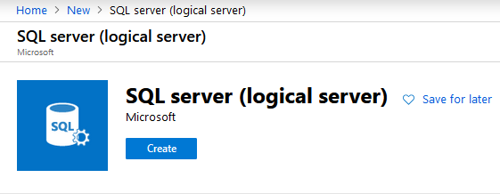

3.  Select **Create** on the SQL Server (logical server) blade. Specify the following information, and select **Next: Networking**:


    -   Subscription: ***Your subscription***

    -   Resource group: **Create new -** **CohoCloud**

    -   Server name: **Specify a unique name**.

    -   Server admin login: **demouser**

    -   Password: **Demo@pass123**

    -   Location: ***Choose a region near you from the following regions which support the SSIS Integration Runtime***:

        -   ***East US***
        -   ***East US 2***
        -   ***West US***
        -   ***West US 2***
        -   ***Central US***
        -   ***South Central US***
        -   ***North Central US***
        -   ***West Central US***
        -   ***Brazil South***
        -   ***Canada Central***
        -   ***North Europe***
        -   ***West Europe***
        -   ***France Central***
        -   ***UK South***
        -   ***East Asia***
        -   ***Southeast Asia***
        -   ***Japan East***
        -   ***Korea Central***
        -   ***Central India***
        -   ***Australia East***
        -   ***Australia Southeast***

        You can find the current list of available regions here: https://azure.microsoft.com/en-us/global-infrastructure/services/?products=data-factory&regions=all 

        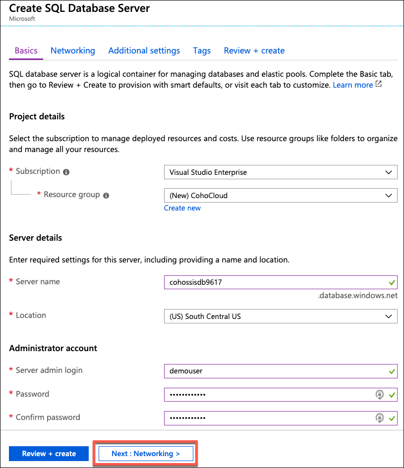

4.  On the networking tab, set **Allow Azure services and resources to access this server** to **Yes**. 

    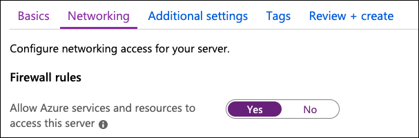

5.  Select **Review + create**, then select the **Create** button to create your logical SQL Server.

### Task 2: Create an Azure Data Factory v2

1.  Browse to the Azure Portal and authenticate at <https://portal.azure.com/>.

2.  Select **+Create a resource** and type **Data Factory** in the search box. Choose **Data Factory** from the results.

    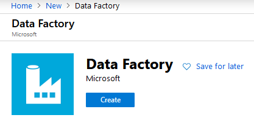

3.  Select **Create** on the Data Factory blade. Specify the following information, and select **Create**:

    -   Name: **Specify a unique name**.

    -   Subscription: **Your subscription**.

    -   Resource group: **Use existing** - **CohoCloud**

    -   Version: **V2**

    -   Location: **Location near you**

    -   Enable GIT: ***Unchecked***

    The Data Factory location is where the metadata of the data factory is stored and where the triggering of the pipeline is initiated from. Meanwhile, a data factory can access data stores and compute services in other Azure regions to move data between data stores or process data using compute services. This behavior is realized through the globally available Integration Runtime to ensure data compliance, efficiency, and reduced network egress costs.

    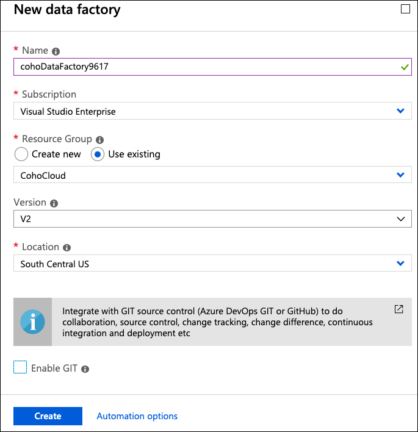


4.  After the Data Factory deployment completes, navigate to the Data Factory and select the Author & Monitor tile. Allow a moment for the Azure Data Factory Services to load and start.

    

5.  Select the **Configure SSIS Integration**.

    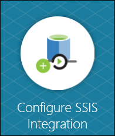

6.  On the first Integration Runtime Setup window, select the following options and then select **Continue**:

    -   Name: **Azure-SSIS**

    -   Location: **The same location you created your logical SQL Server**.

    -   Node size: **Standard\_D2\_v3 (2 Core(s), 8192 MB)**

    -   Node Number: **1**

    -   Edition: **Standard**

    The Integration Runtime Location defines the location of its back-end compute, and essentially the location where the data movement, activity dispatching, and SSIS package execution are performed. The Integration Runtime location can be different from the location of the Data Factory it belongs to. For your location, select the location of your integration runtime. Only supported locations are displayed. We recommend that you select the same location as your SQL Server logical server to host SSISDB.

    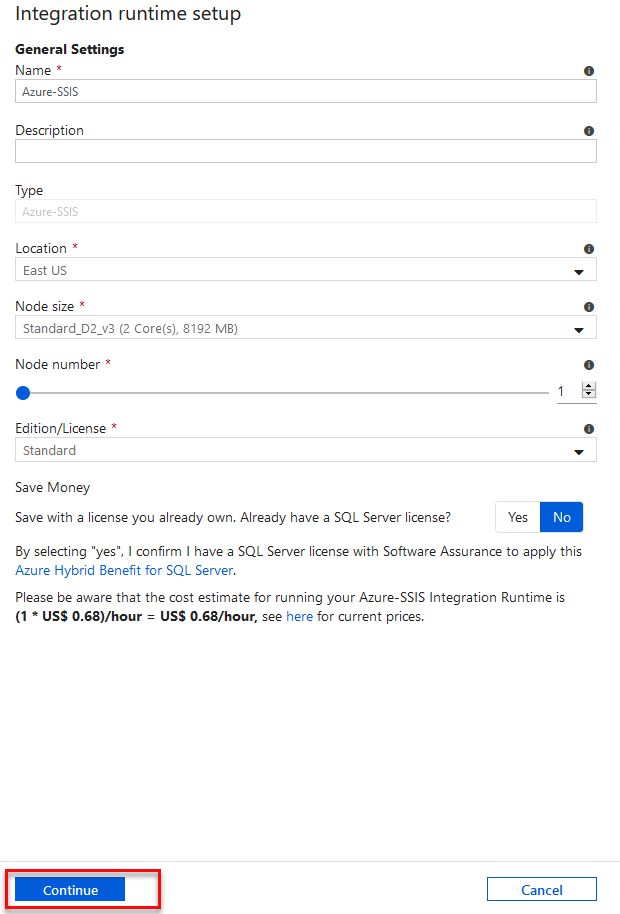

7.  On the second Integration Runtime Setup window, enter the fields with the following options, select **Test Connection** and then select **Continue**:

    -   Subscription: **Your subscription**.

    -   Location: **Same location you created your logical SQL Server in**.

    -   Catalog Database Server Endpoint: **\<your logical sql server name\>.database.windows.net**

    -   Admin Username: **demouser**

    -   Admin Password: **Demo@pass123**

    -   Catalog Database Service Tier: **S1**

    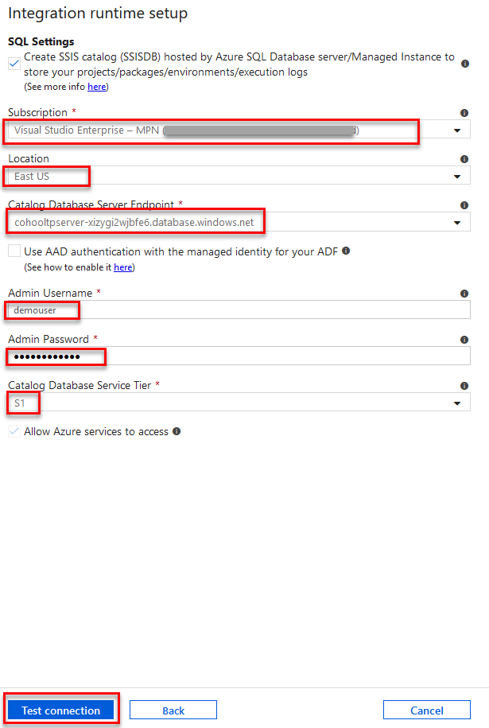

8.  On the final Integration Runtime Setup window, set **Maximum Parallel Executions Per Node = 1**, then select **Continue**, then select **Create** on the summary page.

    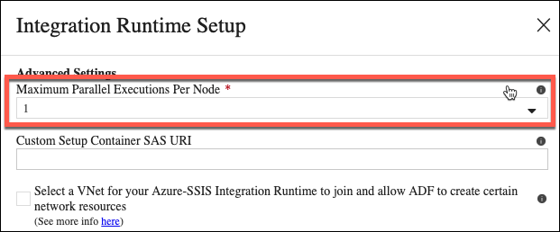

9.  The Integration Runtime can take 20-30 minutes to deploy and start. You do not need to wait on it to complete and may continue with the lab. The status will change from Starting to Running when it is complete.

    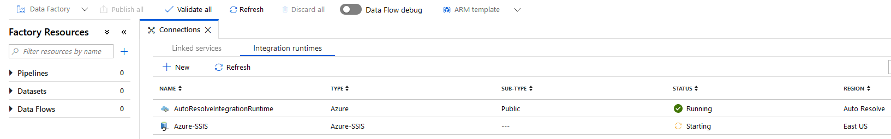

### Task 3: Create an Azure SQL Data Warehouse

1.  Browse to the Azure Portal and authenticate at <https://portal.azure.com/>. 
2.  Select **+Create a resource** and type **SQL Data Warehouse** in the search box. Choose **SQL Data Warehouse** from the results.

    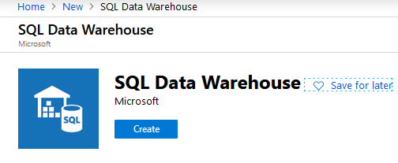

3.  Select **Create** on the SQL Data Warehouse blade. Specify the following information. 

    -   Name: **CohoDW**
    -   Resource group: **CohoCloud**
    -   Server: **Create new**
                                              
    
        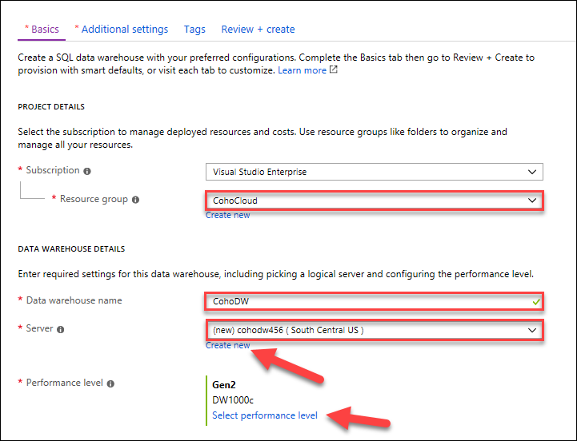

4.  On the new server blade, specify the following options, and select **OK**:

    -   Server name: **Choose a unique server name**.
    -   Server admin login: **demouser**
    -   Password: **Demo@pass123**
    -   Location: **Same location you created your logical SQL Server in**.
    -   Allow azure services: **checked** 

        

5.  Select the Performance level link, select the **Gen2** tab and set the performance to **DW400c,** and select **Apply**.

    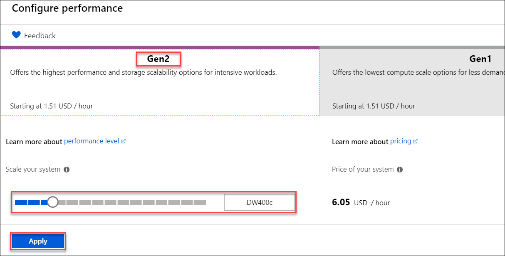

6.  On the SQL Data Warehouse blade, select **Review + create**.  Verify your configuration your and select **Create**.

### Task 4: Create an Azure Storage Account

1.  Browse to the Azure Portal and authenticate at <https://portal.azure.com/>.

2.  Select **+Create a resource** and type **Storage account** in the search box. Choose **Storage account** from the results.

    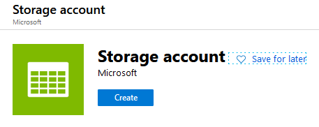

3.  Select **Create** on the Storage account blade. Specify the following information, and select **Review + create**:

    -   Resource group: **Use existing** - **CohoCloud**

    -   Storage account name: **Specify a unique name**.

    -   Location: **Same location you created your logical SQL Server in**.

    -   Performance: **Standard**

    -   Account kind: **StorageV2 (general purpose v2)**

    -   Replication: **Locally-redundant storage (LRS)**

    -   Access tier: **Hot**    

        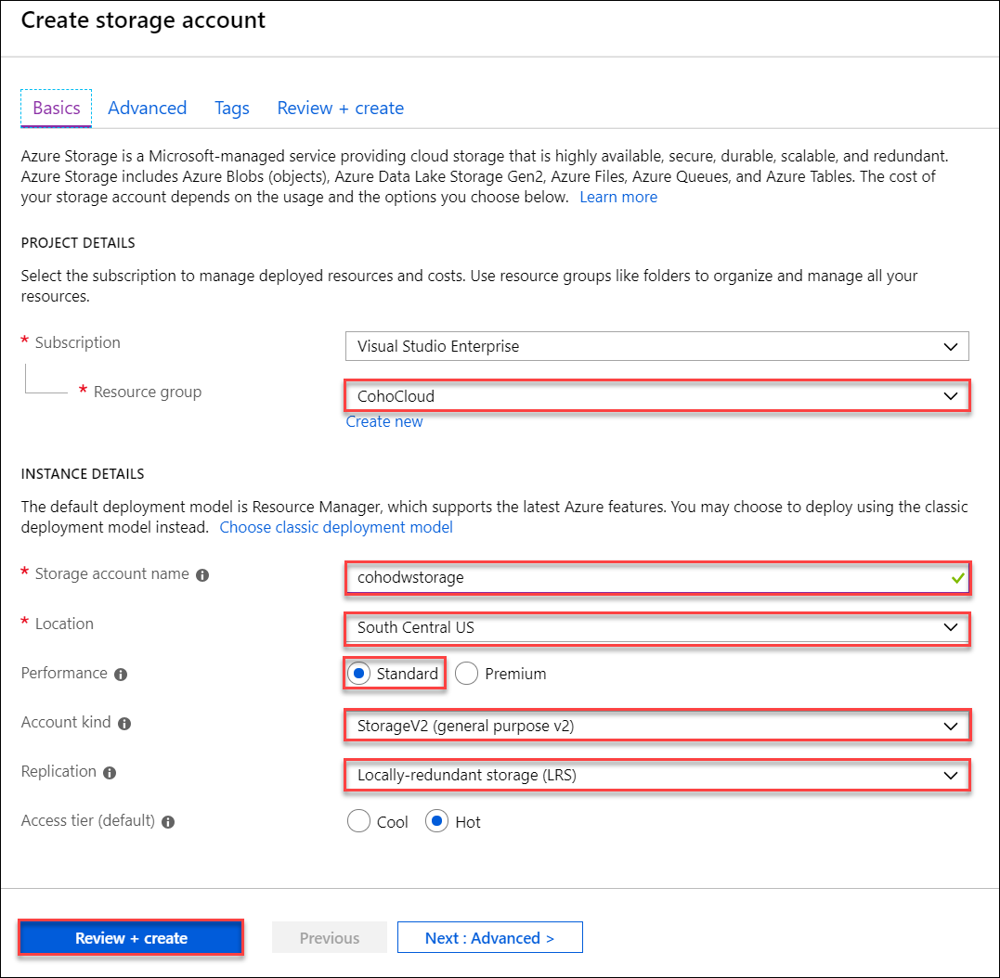

4. On the Review + create tab, verify your configuration choices and select **Create**.

5.  Navigate to the new storage account, and select **Containers**.

    

6.  On the Blob service blade, select the **+Container** button.

    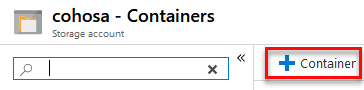

7.  On the New container blade type **migration** for the name. Then, select **OK**.

    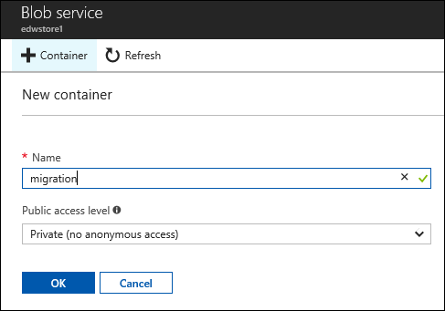

### Task 5: Create Analysis Services

The first four steps of this task walk you through creating an organizational account to use as the administrator account for Analysis Services. This account must be an organizational account, it cannot be a Microsoft live account. If you are doing this lab with an existing organizational account you may skip the first four steps of this task and use your organizational account in place of the asadmin account.

1.  From the Azure Portal, open Azure Active Directory.

    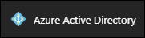

2.  Select **Users** from the menu.

    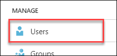

3.  Select the **+New user** button, and create a user using the following configuration:

    -   Name: **asadmin**

    -   User name: **asadmin@\<your-domain\>.com**

    -   Password: *Check the **Show password** box, then **copy** the password into Notepad*.

    >**Note**: The User name setting should be in the form \<name\>@\<your-domain\>.com. If you do not know your domain name you can get it by hovering over your login information in the upper right corner of your browser window.

4.  Select the **Create** button.

5.  Open an incognito or in-private browser window, navigate to https://portal.azure.com and login with your new asadmin account. You will be prompted to change your password. Change your password. Make sure to note your new password then close the browser window.

6.  Select **+Create a resource** and type **Analysis Services** in the search box. Choose **Analysis Services** from the results.

    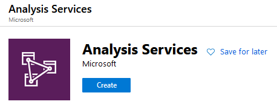

7.  Select **Create** on the Analysis Services information blade.

8.  Use the following configurations then select **Create**:

    -   Server name: **Choose a unique name**.

    -   Subscription: **Choose your subscription**.

    -   Resource group: **CohoCloud**

    -   Location: **Same location you created your logical SQL Server in**.

    -   Pricing tier: **S0 Standard**

    -   Administrator: **Select the asadmin account you created earlier**.

    -   Backup Storage Settings: **Not configured**

    -   Storage key expiration: **Never**


        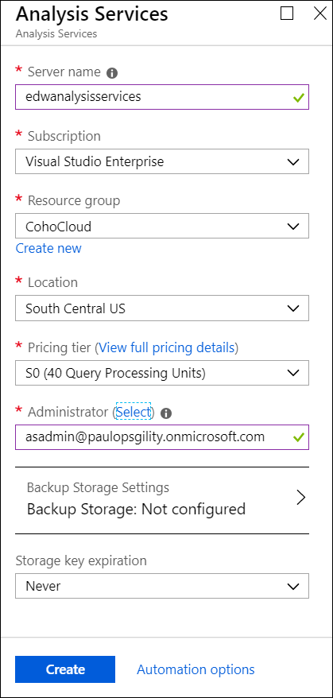

### Task 6: Prepare Environment and Create Migration Accounts

1.  In the Azure Portal navigate to your **CohoCloud** resource group, and select on your storage account.

2.  In the Storage account blade, and under settings, select on **Access keys**.

    

3.  Copy the **storage account name** and access **key1**. and paste into notepad for later use.

    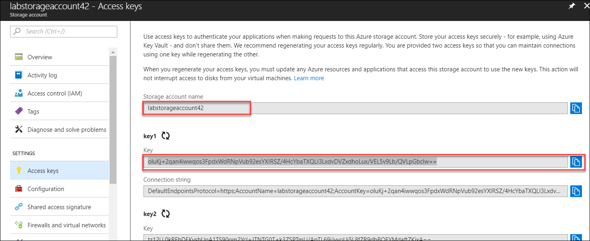

4.  Open a remote desktop session to the **SQLCohoDW** virtual machine that you created before the lab using the **demouser** login and **Demo@pass123** password. From within the **SQLCohoDW** virtual machine, open a browser window, and connect to the **Azure Portal**.

    > **Note**: If you do not have a SQLCohoDW virtual machine, you should verify that you have completed the pre-requisite steps in the correct subscription.  

5.  Navigate to your **CohoCloud** resource group. Then, select the logical SQL Server that hosts your Azure SQL Data Warehouse.

    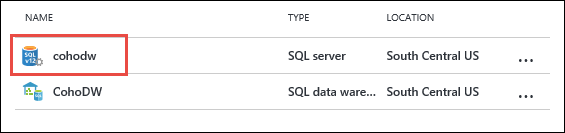

6.  In the security menu on the left, select **Firewalls and virtual networks**.

7.  In the cohodw - Firewalls and virtual networks blade, select the **+Add client IP** button. Then, select the **Save** button.

    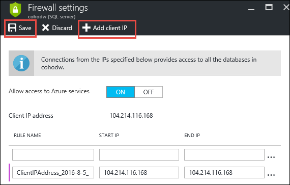

8.  Back in the **CohoCloud** resource group, select the **CohoDW** data warehouse, and copy the server name.

    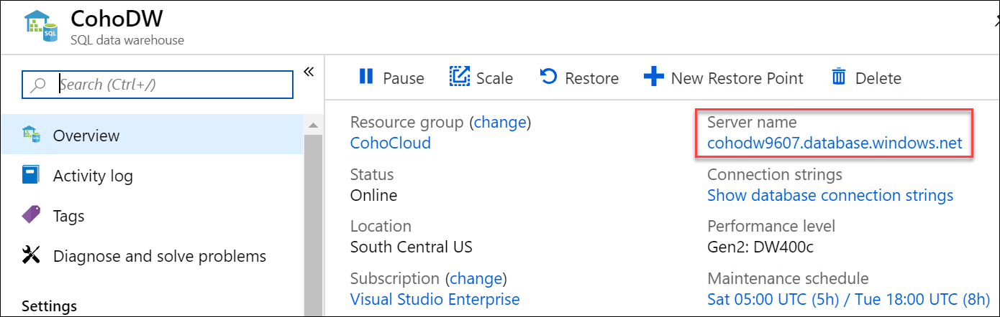

9.  Next, we want to create a special account to perform our data load operations. This account will be added to the larger resource class. By default, all accounts are initially in the smallrc resource class. Adding the account to the largerc resource class allows the account to consume more memory during query execution which will be more efficient for operations such as data loads and maintenance tasks.

    Open the **C:\\LabFiles\\CreateDataLoader.sql** script in SQL Server Management Studio.

10. Connect to your Azure SQL Data Warehouse using the server name that you copied from the Azure portal. Change your authentication method to SQL Server Authentication and use the **demouser** account and password **Demo@pass123**. 

    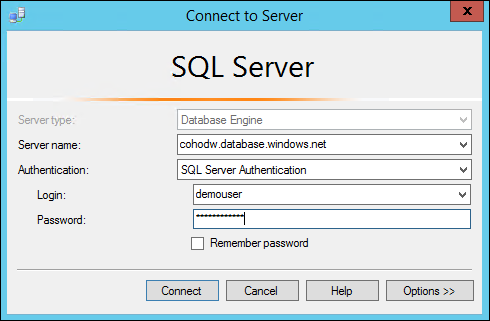

    >**Note**: By default, SQL Server Management Studio will attempt to connect you to the local SQL Server instance called SQLCohoDW. You must connect to the Azure SQL Data Warehouse which is the server name that you copied from the Azure portal in a previous step.

11. Verify you are connected to the **master** database.

    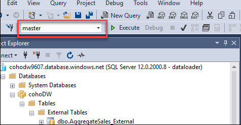

12. Highlight the first two commands of the script, and select the **Execute** button.

    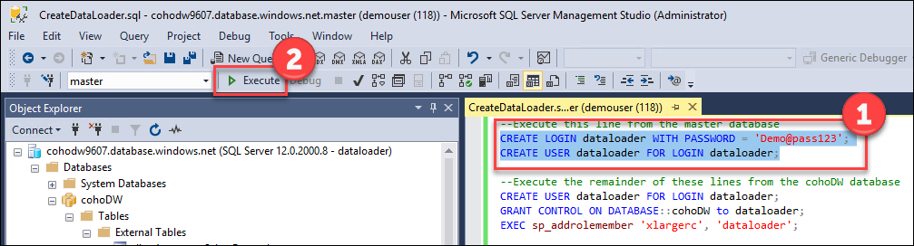

13. Change the database context to **cohoDW**.

    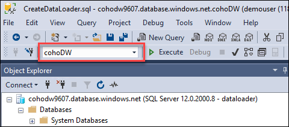

14. Highlight the remaining lines of the script, and select the **Execute** button.

    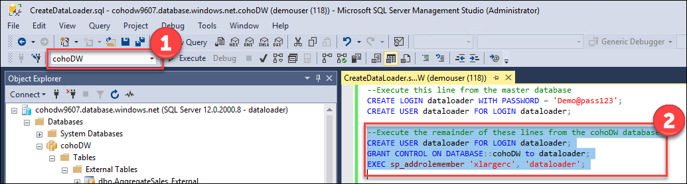

## Exercise 2: Data and schema preparation

Coho is relying on you to migrate the data warehouse to Azure SQL Data Warehouse. One of the most important steps is preparing the data and schema. During this phase, you will need to verify compatibility of the schema and data, and make any necessary changes required for a successful migration.

### Task 1: Validate schema and data

1.  In the Azure portal, navigate to your **CohoOnPremEnvironment** resource group, then connect to the **SQLCohoDW** virtual machine. If you are still connected you may use the same connection.

2.  Launch SQL Server Management Studio, connect to the local **SQLCohoDW** instance with Windows Authentication on the demouser account and the Demo@pass123 password, then open a **New Query** window.

    

3.  Run the following query to check for data incompatibility and potential data length issues:

    ```
    USE CohoDW
    GO
    SELECT t.[name] as [Table], 
           c.[name] as [Column], 
           c.[system_type_id], 
           c.[user_type_id], 
           y.[is_user_defined], 
           y.[name]
    FROM sys.tables t JOIN sys.columns c ON t.[object_id] = c.[object_id]
                       JOIN sys.types y ON c.[user_type_id] = y.[user_type_id]
    WHERE y.[name] IN ('geography', 'geometry', 'hierarchyid', 'image', 'ntext',
    'numeric', 'sql_variant', 'sysname', 'text', 'timestamp', 'uniqueidentifier', 'xml')
      OR (y.[name] IN ('varchar', 'varbinary') AND ((c.[max_length] = -1) or 
                                                  (c.max_length > 8000)))
      OR (y.[name] IN ('nvarchar') AND ((c.[max_length] = -1) or 
                                   (c.max_length > 4000))) OR y.[is_user_defined] = 1;
    ```

    >**Note**: A full list of incompatible table features and data types can be found in the migration documentation at: <https://azure.microsoft.com/en-us/documentation/articles/sql-data-warehouse-overview-migrate/>.

4.  The output of the query shows the table and column, but not the reason for the incompatibility. To gain more insight into the reason you can script the table out by expanding the CohoDW database in Object Explorer, right-select the table, select Script Table as -\> CREATE To -\> New Query Editor Window.

    

5.  From the script of the table, you can see that the 'TSQL' column of the 'DataLog' table has a data type nvarchar(4000) equivalent to 8000 bytes which means that the data may potential exceed the maximum data size.

    ![In the New Query Editor Script for the table, the following line is circled: \[TSQL\] \[navchar\](4000) NOT NULL.](images/Hands-onlabstep-by-step-MigrateEDWtoAzureSQLDataWarehouseimages/media/image48.png "Row exceeding maximum data size")

6.  Before we fix this column, we must validate that none of the data would be truncated. Check the maximum actual data size with the following query:

    ```
    SELECT MAX(DATALENGTH([TSQL]))
    FROM DatabaseLog
    ```

    >**Note**: The result of 3034 means our longest value is 3034 bytes or 1517 characters leaving us plenty of space to modify the column with no loss of data.

7.  Modify the column by executing the following query:

    ```
    ALTER TABLE dbo.DatabaseLog ALTER COLUMN [TSQL] nvarchar(2000)
    ```

### Task 2: Prepare Azure SQL Data Warehouse and migrate schema

1.  In SQL Management Studio, select the **connect** button in Object Explorer, chose **Database Engine**, and connect to your SQL Data Warehouse using the **demouser** account and password to verify connectivity.

    

2.  On your Azure SQL Data Warehouse, expand **databases**, select the **CohoDW** database followed by selecting the **New Query** button. We use this query window to run our script to generate the schema later.

3.  Under your SQLCohoDW instance of SQL Server, right select your local copy of CohoDW, and select **Generate Scripts** to launch the Generate and Publish Scripts wizard.

    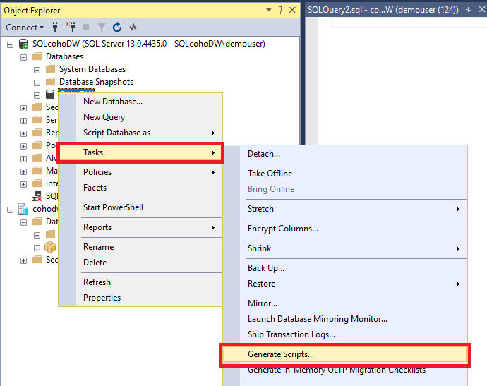

4.  Select **Next** on the Introduction screen.

5.  On the Choose Objects screen, select the **Select specific database objects** radio button, and check **Tables** followed by selecting **Next**.

    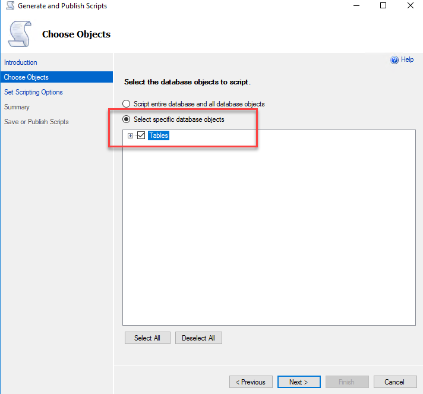

6.  On the Set Scripting Options screen, select the **Save to Clipboard** radio button, and select **Next**.

    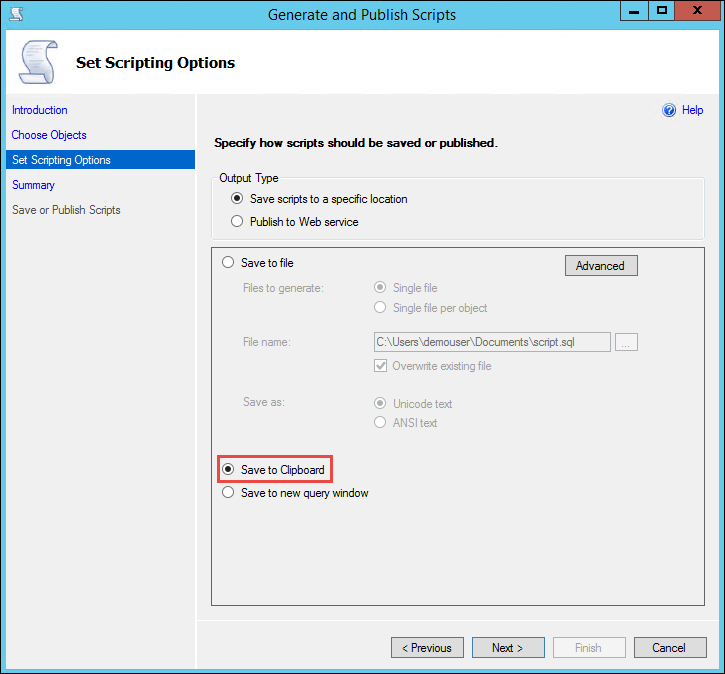

7.  Accept the defaults for the remaining screens, and select **Finish**.

8.  Paste the results into the Query window that you opened and connected to your Azure SQL Data Warehouse.

9.  This script still needs to be modified before it will run correctly in Azure SQL Data Warehouse because some T-SQL syntax is not supported in Azure SQL Data Warehouse. Make the following updates to the script:

    -   Execute a Find and Replace on your script to replace all occurrences of **ON \[PRIMARY\]** with blank space to remove them from the script. **ON \[PRIMARY\]** is used in a CREATE TABLE statement to indicate which file group you would like to create the table on. Since filegroup management and storage in Azure SQL Data Warehouse are managed by Azure, this part of the statement is not necessary. 

        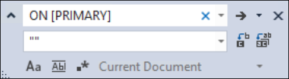

    -   Execute a **case sensitive** Find and Replace on your script to replace all occurrences of **USE \[** with **\--USE \[** to comment out those lines. Make sure you specify case sensitive to avoid unintentionally modifying any column names. The USE command instructs SQL Server to change the database context to the specified database. Azure SQL Data Warehouses are allocated at the database level so this command is unsupported.

        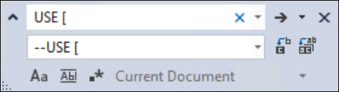

    -   Comment out the leading **GO** statement. 

        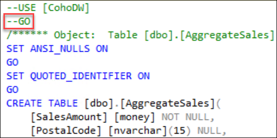

10. Change the database context from master to CohoDW, Run the script by selecting the **Execute** button. This will use the default options to create tables, Clustered Columnstore Indexing and ROUNDROBIN distribution.

    

11. Execute the following query to verify that your tables were created. There should be 33 rows returned.

    ```
    SELECT * FROM sys.tables
    ```

##  Exercise 3: Migrate the data to Azure SQL Data Warehouse

This exercise is focused on migrating the data from your existing data warehouse into SQL Data Warehouse. We will be pulling the data and uploading it to an Azure storage account. We will then import the data via Polybase.

### Task 1: Exporting the data from your current data warehouse

1.  Connect to your **SQLCohoDW** virtual machine.

2.  Open the **C:\\LabFiles\\bcp\_commands.txt** file. These are the bcp commands for each of the tables you need to migrate. The line below is an example. Notice the bcp commands all use the -C 65001 parameter. This indicates the output will use the UTF-8 code page which is required by Azure SQL Database's Polybase feature. This code page is only an option with bcp.exe that ships with SQL Server 2016 and later tools. If you are using an older version of bcp, you will have an additional step to convert to UTF-8.

    ```
    bcp "select [ScenarioKey],REPLACE([ScenarioName],'|','||') from [CohoDW].[dbo].[DimScenario]" queryout "C:\Migration/dbo.DimScenario.txt" -q -c -C 65001 -t "|" -r "\n" -S localhost -T
    ```

3.  Close the file after you are done reviewing it. Change the file name to **bcp\_commands.bat**.

    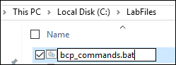

4.  Create a new folder named **C:\\Migration** on the local drive if it does not already exist. This is where the bcp\_commands.bat will save data to.

5.  Open a command prompt and execute **C:\\LabFiles\\bcp\_commands.bat**.

    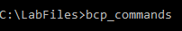

    > **Note:** In a production environment, you would likely make some effort to parallelize the execution of the various bcp commands. For larger tables, you also might parallelize the export from a single table.

6.  Navigate to the **C:\\Migration** folder. If the commands completed successfully, you will have **33 files**. Please review the files thoroughly to make sure you have all the files generated.

    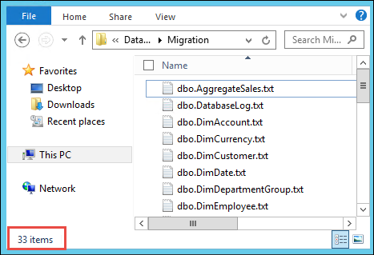

### Task 2: Transfer your data to Azure

1.  From your SQLCohoDW virtual machine navigate, download and install the latest version of the Microsoft Azure Storage tools from <http://aka.ms/downloadazcopy>.

2.  Open a command prompt and navigate to the **C:\\Program Files (x86)\\Microsoft SDKs\\Azure\\AzCopy** folder.

3.  Update the following command with the storage account name and key that you saved earlier and execute it to begin copying your data files to Azure (all of the text is a single command).

    ```
    AzCopy /Source:"C:\Migration" /Dest:https://<YourStorageAccount>.blob.core.windows.net/migration /DestKey:<YourStorageAccountKey> /pattern:*.txt /NC:2
    ```

4.  Confirm all 33 files were transferred successfully.

    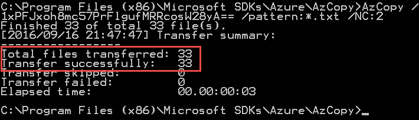

     Verify the files are in the correct storage container by navigating to your storage account, selecting on **Containers**, and selecting your **migration** container.

     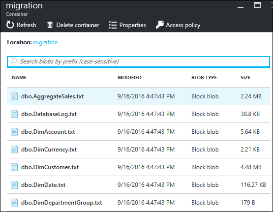

5.  Open SQL Server Management Studio, and connect to the **CohoDW** database of your SQL Data Warehouse using the **dataloader** account.

6.  Execute the following to create a database scoped credential you will use to store the access key to the migration storage account. Make sure the password is correct.

    ```
    CREATE MASTER KEY ENCRYPTION BY PASSWORD = 'Demo@pass123';

    CREATE DATABASE SCOPED CREDENTIAL MigrationCredential
    WITH IDENTITY = '<YourStorageAccountName>' , SECRET = '<YourStorageAccountKey>'
    ```

7.  Create an external data source by executing the following query. The external data source defines the location of your data and the credential used to access it. Again, be sure to replace the values with your own storage name and key.

    ```
    CREATE EXTERNAL DATA SOURCE MigrationStor WITH (TYPE = HADOOP,
    LOCATION=
    'wasbs://migration@<YourStorageAccountName>.blob.core.windows.net',
    CREDENTIAL = MigrationCredential);
    ```

8.  Create an external file format by executing the following query. The external file format defines the external storage and its layout.

    ```
    CREATE EXTERNAL FILE FORMAT MigrationFiles WITH(FORMAT_TYPE = DelimitedText,
    FORMAT_OPTIONS (FIELD_TERMINATOR = '|'));
    ```
9.  Open the **C:\\LabFiles\\CreateExternalTables.sql** file in SQL Server Management Studio and verify that you are connected to your Azure SQL Data Warehouse **CohoDW** database.

10. This file contains all of the external table definitions for our tables and directly leverages the external data source and external file format we created above. Select **Execute** to create the external tables.

    

11. Run the following code to verify that 33 tables were created:

    ```
    SELECT * FROM SYS.TABLES WHERE is_external = 1
    ```

12. From your **SQLCohoDW** virtual machine, open the **C:\\LabFiles\\LoadData.sql** file in SQL Server Management Studio.

13. The commands in this file insert data extracted directly from the data files stored in Azure Storage via the external tables we defined in the previous steps. Select **execute** to begin the data load.

     

14. After your data is uploaded, you can select data from any of the tables to verify success. In production environments, you would go through a much more thorough data validation process.

## Exercise 4: Migrate an SSIS Package to Data Factory v2

In this exercise, you will use the SSIS Integration Runtime in Azure Data Factory to run a pre-built SSIS package. You will start by deploying a pre-built package into your SSISDB Catalog. You will then schedule that package via Azure Data Factory.

### Task 1: Deploy SSIS Package to Data Factory

1.  From your **SQLcohoDW** virtual machine, navigate to the Azure portal.

2.  Navigate to the **CohoCloud** resource group and open your **cohosssisdb** server. This server was created by Azure Data Factory when you provisioned your Azure-SSIS Integration Runtime.

3.  Select the **Firewalls and virtual networks** from the Security menu on the left. 

4.  Select the **+Add client IP** button, then select **Save**.

    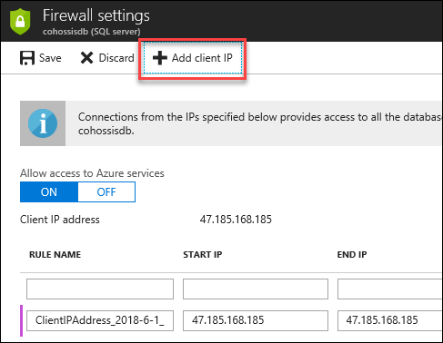

5.  Navigate to the SSISDB overview blade, copy the **Server name** and paste it into Notepad for later use.

    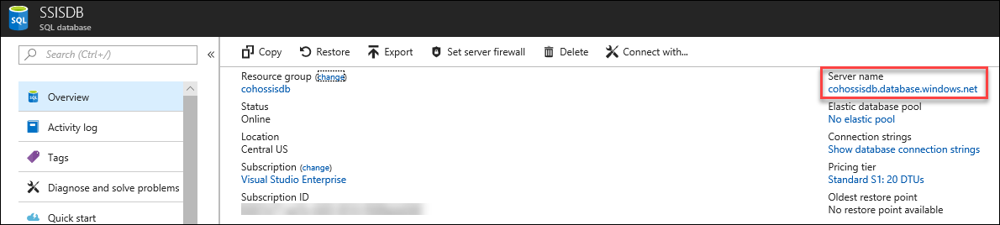

6.  Open SQL Server Management Studio, and select the **Connect** button in Object Explorer. Paste the server name you just copied into the server name field, use **demouser** for the login and **Demo@pass123** for the password. Then select on **Options \>\>**.

    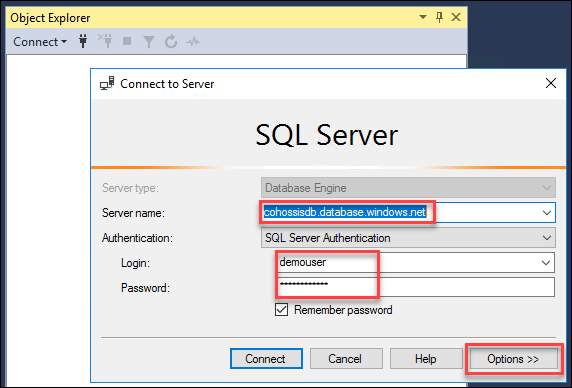

7.  On the **Connection Properties** tab, select the **SSISDB** database then select **Connect**.

    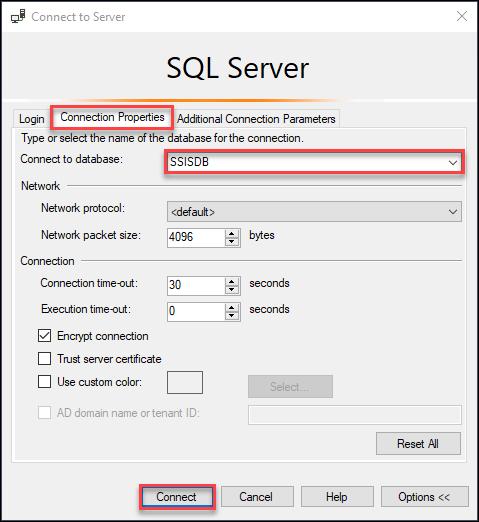

8.  Expand Integration Services Catalogs, right-select SSISDB and choose **Create Folder...**

    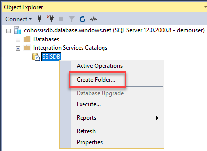

9.  Name your folder \"Azure-SSIS\" and select **OK**.

    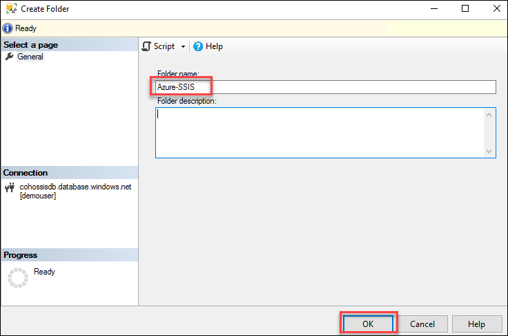

10. Expand the **Azure-SSIS** folder, right-select **Projects** and choose **Deploy Project...**

11. Select next on the information window, then on the Select Source window, make sure that the deployment model is set to **Project Deployment** and **Project deployment file** is selected. Then browse to **C:\\LabFiles\\DataLoad.ispac** and select **Next**.

    

12. Select **OK** on the warning message.

    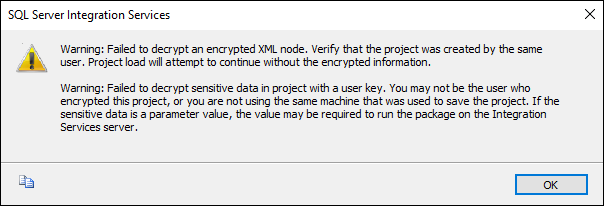

13. On the Select Destination window, make sure the server name of your SSISDB database server is set correctly, use demouser and Demo@pass123 for authentication, select **Connect** to verify your credentials, then select Next.

    

14. Package validation will show you warnings regarding the connection. Select **Next** to continue.

    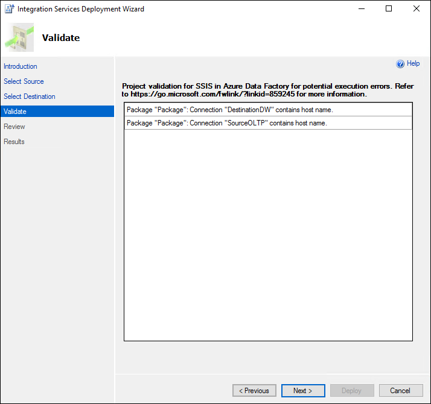

15. Select **Deploy** on the review window. The deployment should take less than a minute. Select Close after the deployment completes.

    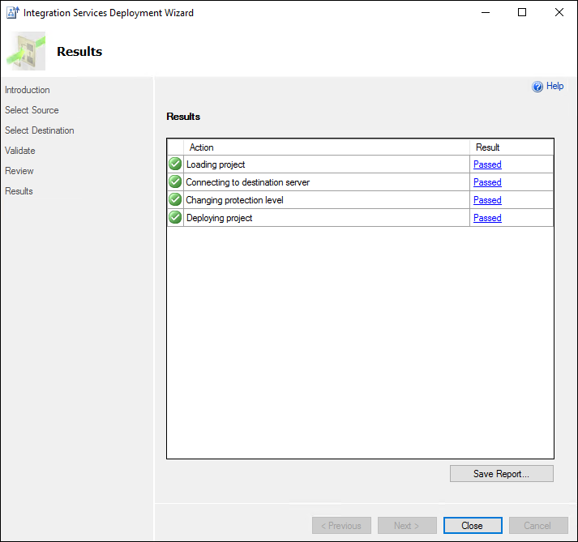

16. Expand the **Projects** folder, the **DataLoad** project, the **Packages** folder, then right-select the **Package.dtsx** file and choose **Configure**.

    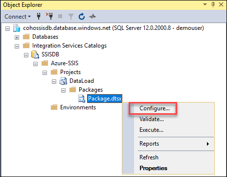

17. Select the **Connection Managers** tab, for the DestinationDW connection, edit the values the **ConnectionString**, **Password** and **ServerName** properties to reflect the name of your Azure SQL Data Warehouse server, then set the password to Demo@pass123.

    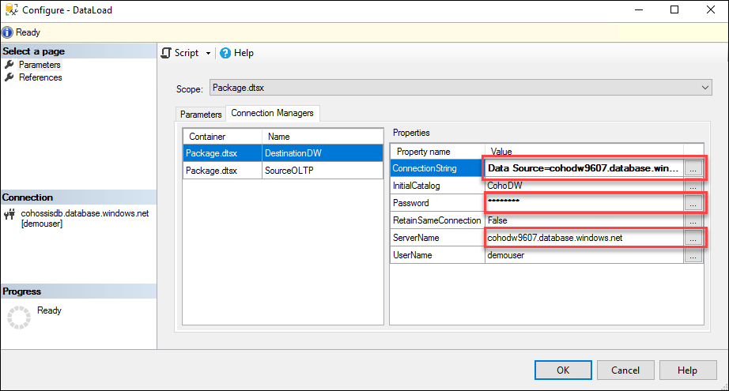

18. Select the SourceOLTP connection, edit the values the **ConnectionString**, **Password** and **ServerName** properties to reflect the name of your Azure SQL Database server that you deployed to the **CohoOnPremisesEnvironment** resource group at the beginning of the lab to host the cohoOLTP database. Select **OK** to save your changes.

    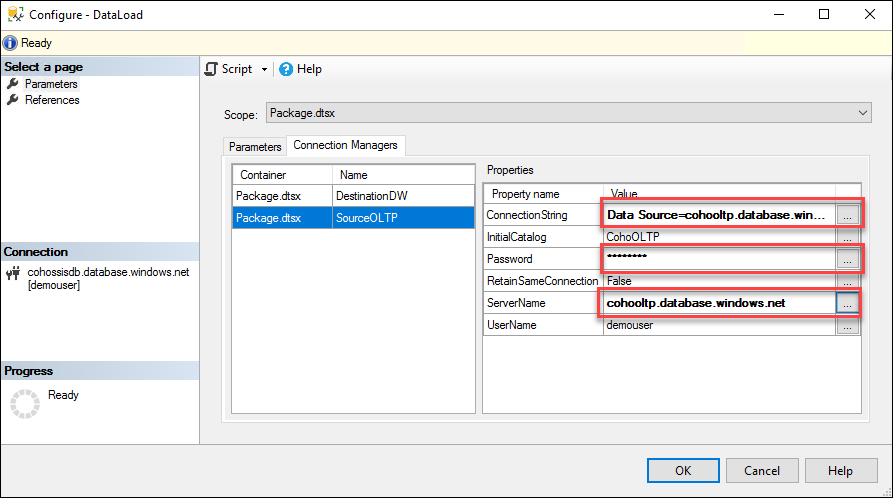

19. You have deployed and configured the SSIS package to run in your Azure environment. You can execute the package by right selecting the package and choosing execute. SQL Server Management Studio will also give you a report of the current status. The execution view allows you to troubleshoot package execution directly from SSMS.

    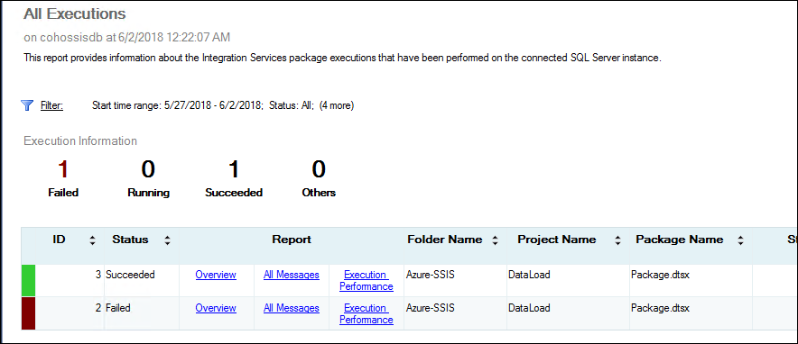

    >**Note**: The SSIS package requires the pre-creation of the destination tables. These tables are created during the execution of the **C:\\LabFiles\\LoadData.sql** script. If you are receiving errors, verify that you did not skip this step earlier.

### Task 2: Schedule the SSIS Package

1.  Open SQL Server Management Studio and connect to your SQL Data Warehouse.

2.  Execute the following to clean up the staging table that are being loaded by our SSIS package.

    ```
    TRUNCATE TABLE dbo.FactResellerSales_STAGE
    ```

3.  Launch the Chrome browser, and navigate to the Azure portal. From the Azure portal, navigate to the CohoCloud resource group, open your Azure Data Factory and select the **Author & Monitor** tile.

    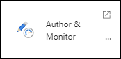

4.  Select the edit button on the left side of the Data Factory portal.

    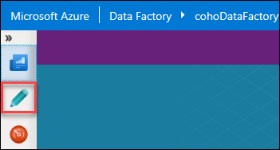

5.  Select the **+** symbol and select **Pipeline**.

    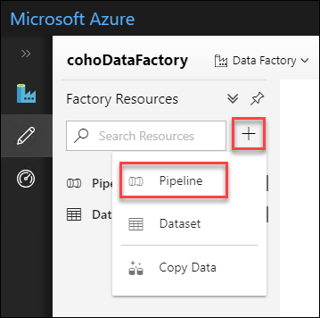

6.  Expand **General**, then drag the **Execute SSIS Package** activity onto the canvas.

    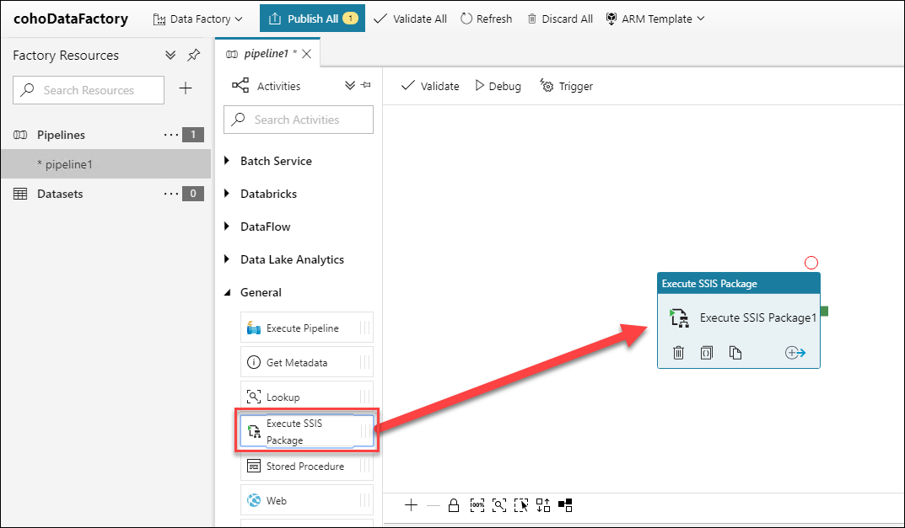

7.  Change the name of your activity to **Load stage tables**.

    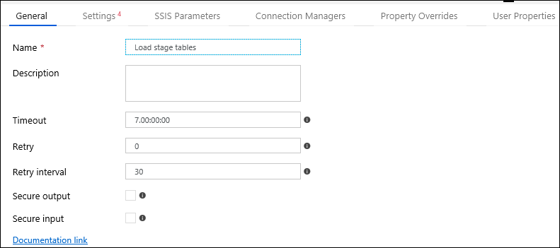

8.  Switch to the settings tab, set the Azure SSIS IR to **Azure-SSIS**, change the package location to **SSISDB**, change your folder to **Azure-SSIS**, change your project to **DataLoad**, change your package to **Package.dtsx** and change your logging level to **Verbose**.

    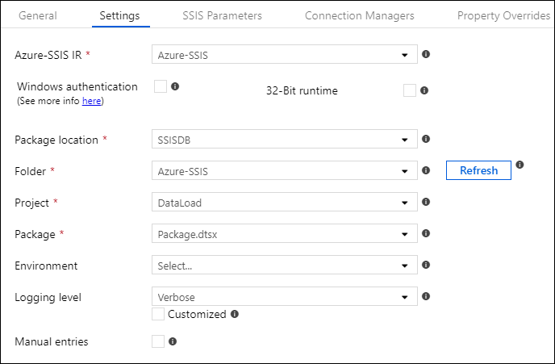

9.  Select the **Publish All** button at the top of the window to save your changes to Azure Data Factory. Wait for the success confirmation before continuing.

    

10. Select the **Add trigger** button at the top of your pipeline pane and select **Trigger Now** to test your pipeline. If the Pipeline Run window opens, select **Finish** to continue.

    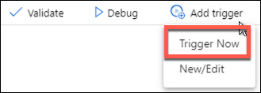

11. In the upper right hand corner, you should see a notification bell, select the bell to see the current status of your pipeline.

    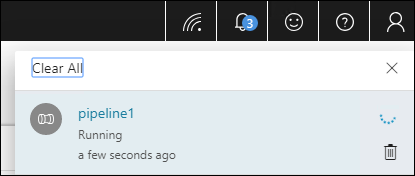

12. To schedule your Pipeline, select the Add trigger button again, this time select **New/Edit**.

    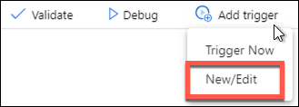

13. On the Add Trigger window, select **Choose trigger...** then select **+New**.

    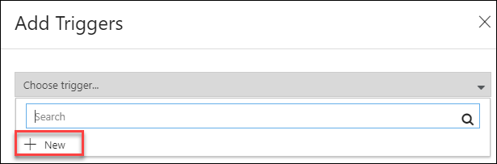

14. Change the name to **15minuteTrigger**, set the type to **Tumbling Window**, set the recurrence to **Every 15 Minutes**, select an end date of one full day from now and verify that **Activated** is set to **Yes**. Then select **OK** twice to complete the configuration.

    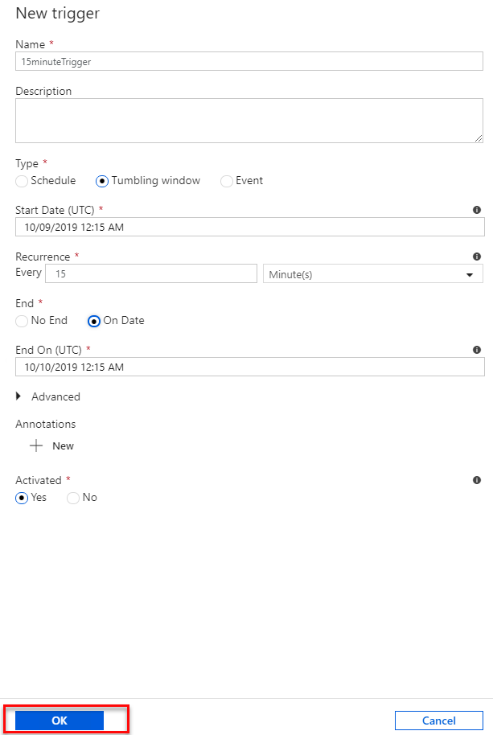

15. Select the **Publish All** button to publish your new trigger.

    

## Exercise 5: Create a Data Pipeline for the Coho360 project

Coho is building out their Coho360 big data project. This project will provide deeper insights from other data sources such as social media. They need you to integrate the data warehouse with the Coho360 project. To facilitate this, they have dropped several files in an Azure Storage account that are representative of the files that you will need to process. 

In this exercise, you will leverage Mapping Data Flow in Azure Data Factory to build a pipeline to pull the files from storage, cleanup the data, merge the data to a single table and load it into your SQL Data Warehouse.

### Task 1: Create linked services 

1.  Navigate to your **CohoOnPremEnvironment** resource group and open the storage account that begins with **coho360-nnnnn**.

2.  Select **Access keys** from the settings menu on the left.

    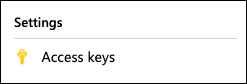

3.  Copy the **storage account name** and **key** and save them in notepad for later use.

    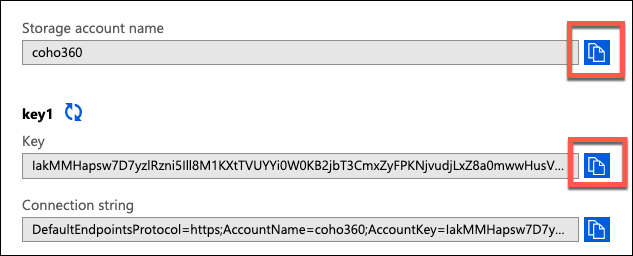

4.  Go back to the overview blade of this storage account and select the **Containers** tile.

    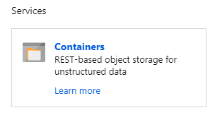

5.  Select the **coho360staging** container.

6.  Select the **Upload** button at the top of the page.

    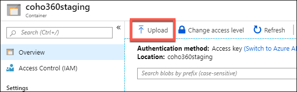

7.  Select the **C:\\LabFiles\\CustomerInfoData.csv**, **C:\\LabFiles\\CustomerMrktResearchData.csv** and **C:\\LabFiles\\CustomerTransData.csv** files and select the **Upload** button. 

    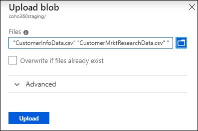

8.  Navigate to your **CohoCloud** resource group and open the Data Factory resource that you created earlier and select on the **Author & Monitor** tile.
   
    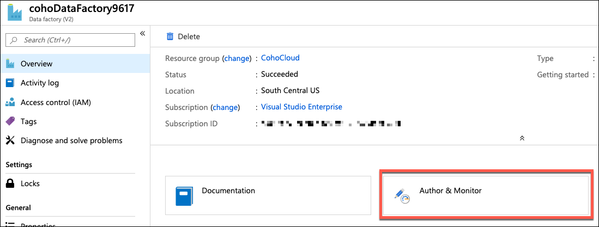

9.  Select the edit button on the left side of the Data Factory portal.

    

10. Enable **Data Flow Debug** at the top of the screen. We will use this in a later task but it takes a few minutes to spin up the compute necessary to support the feature. You do not need to wait for this to complete. We are simply doing this here to minimize the wait time later in the lab. 

    

11. Select the **Connections** in the lower left of the canvas.

    

12. Under the **Linked Services** tab, select **+New**.

    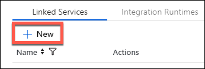

13. On the **New Linked Service** window, select **Azure Blob Storage** and select **Continue**.

    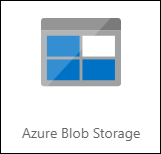

14. On the **New Linked Service (Azure Blob Storage)** window use the following configurations and then select **Create**.

    - Name: **Coho360BlobStorage**
    - Connect via integration runtime: **AutoResolveIntegrationRuntime**
    - Authentication method: **Account key**
    - Account selection method: **From Azure subscription**
    - Azure subscription: *Choose your Azure subscription*
    - Storage account name: *Choose the storage account that begins with coho360-*

     window")

15. Now we need to create another linked service to support our SQL Data Warehouse. From the Linked Services tab, select **+New**.

    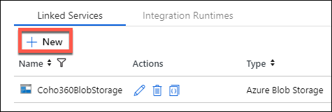

16. From the **New Linked Service** window, select **Azure SQL Data Warehouse** and then select **Continue**.

    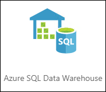

17. On the **New Linked Service (Azure SQL Data Warehouse)** window use the following configurations and then select **Create**.

    - Name: **CohoDW**
    - Connect via integration runtime: **AutoResolveIntegrationRuntime**
    - Account selection method: **From Azure subscription**
    - Azure subscription: *Choose your Azure subscription*
    - Server name: *Choose the server name of your CohoDW SQL Data Warehouse*
    - Database name: **CohoDW**
    - Authentication type: **SQL Authentication**
    - User name: **demouser**
    - Password: **Demo@pass123**

    ")

18. Select **Publish All** to publish and save your linked services.

### Task 2: Create the datasets

1.  Navigate to your **CohoCloud** resource group and open the Data Factory resource that you created earlier and select on the **Author & Monitor** tile.
   
    

2.  Select the edit button on the left side of the Data Factory portal.

    

3.  For now, we will need to create a total of three datasets for this pipeline. These datasets will be for our data files in Azure Blob Storage. These files represent the files that will be generated by another system in the Coho360 project. We will extract data from these three files, merge and transform them and then load the data into to the SQL Data Warehouse. 

    Under Factory Resources, hover over the 0 next to **Datasets** and it will change to ellipses, select the ellipses and then choose **New Dataset**.

    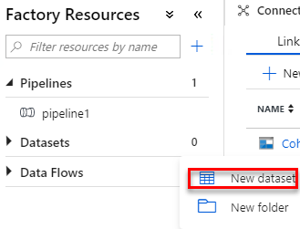

4.  On the **New Dataset** window, select **Azure Blob Storage** and select **Continue**.

    

5.  On the **Select Format** window, select **DelimitedText** and select **Continue**.

    

6.  On the **Set Properties** window, set the name to **CustomerInfo** and choose the **Coho360BlobStorage** linked service. Select **Browse** next to the file path and choose the **CustomerInfoData.csv** file that you loaded earlier. Finally, check the box for **first row as header**, select import schema **from connection/store** and select **OK**.

    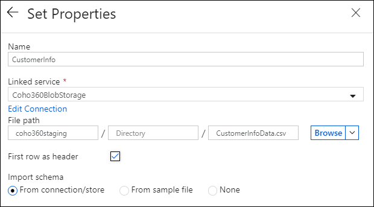

7.  Repeat the process to add your two additional data files as datasets. The dataset name to file mapping should be as follows:

    - **CustomerMrktResearch** -> coho360staging/CustomerMrktResearchData.csv
    - **CustomerTrans** -> coho360staging/CustomerTransData.csv

8.  Select **Publish All** to publish and save your changes.

### Task 3: Create data sources in Data Flow 

1.  We are going to use a Data Factory Data Flow to process our data. Under the Factory Resources menu, select the 0 to the right of **Data Flows** and select **New Data Flow**.

    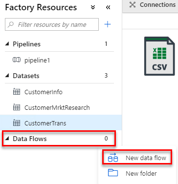

2.  Close any informational pop-ups. Throughout this exercise you may dismiss all of these pop-ups.

3.  Rename your Data Flow to **MergeCustomer360Data**.

    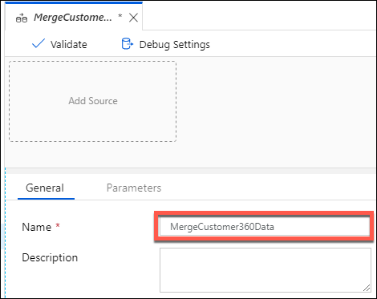

4.  On the Data Flow canvas, select the **Add Source** box. 

    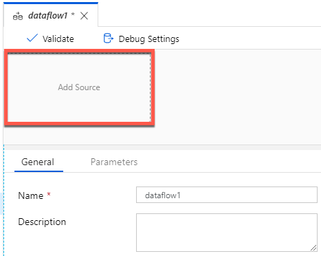

5.  On the **Source Settings** tab, set the name to **CustomerInfo** and then choose **CustomerInfo** for the source dataset.

    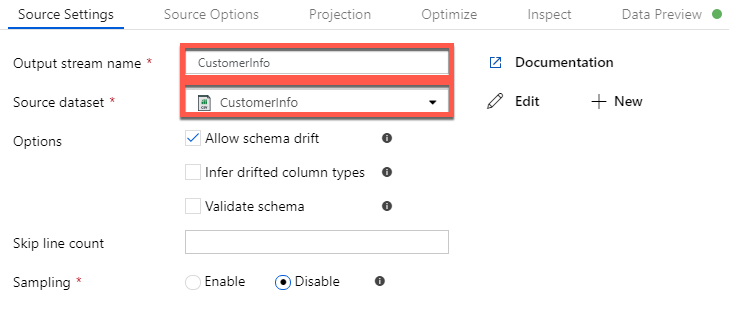

    >**Note**: We have left the sampling set to disabled. This is because the sampling will cause the join failures later in this exercise. For very large datasets you would want to enable sampling to improve the performance of the debugging process.

6.  Select the Projection tab. The projection tab allows you to specify the data types in the dataset. For this dataset we will specify the data types manually. For the columns listed below, make the following data type modifications.

    - CustomerKey: **integer**
    - NameStyle: **boolean**
    - BirthDate: **date** format: **yyyy-MM-dd**

    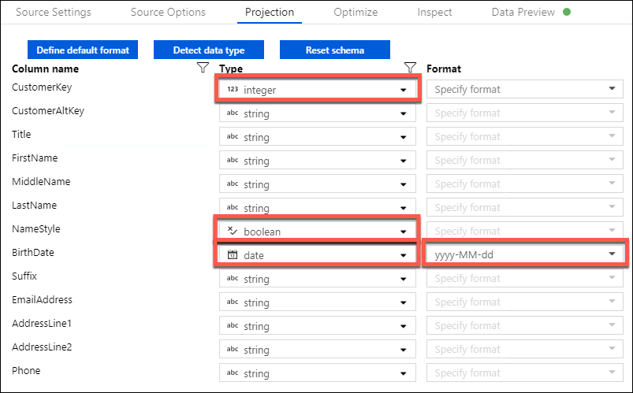

7.  You can use the **Data Preview** tab to view the resulting data.

    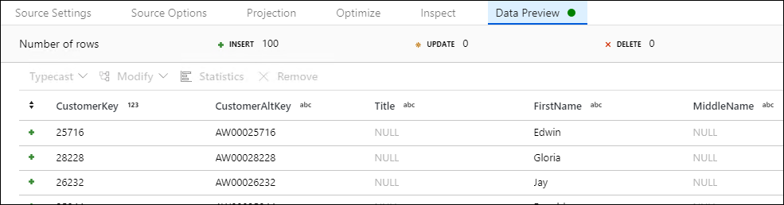

8.  Now repeat the above process to add sources for the **CustomerMrktResearch** and **CustomerTrans** datasets. For both of these you may use the **Detect Data Type** feature to automatically populate the data types as in the example below.

    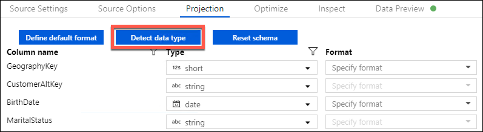

### Task 4: Join data sources in Data Flow 

1.  From your Data Flow canvas, select the **+** symbol to the right of your CustomerInfo dataset.

    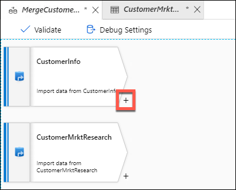

2.  Choose **Join** from the from the menu.

    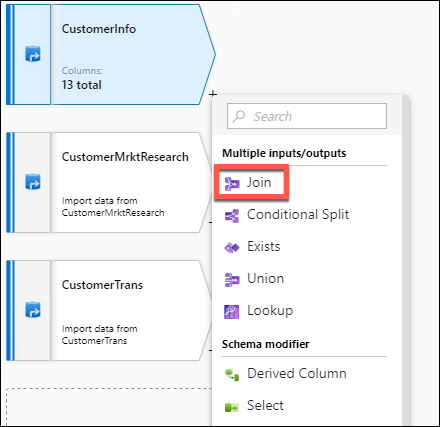

3.  On the **Join Settings** tab, use the following configurations:

    - Output stream name: **JoinCustMrktResearch**
    - Left stream: **CustomerInfo**
    - Right stream: **CustomerMrktResearch**
    - Join type: **Inner**
    - Join condition, left: **CustomerAltKey**
    - Join condition, right: **CustomerAltKey**

    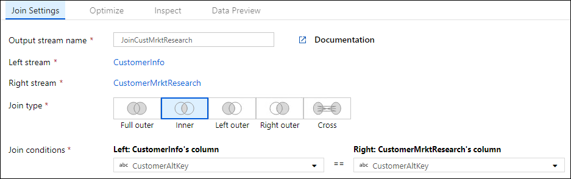

4.  You can review the preliminary results on the **Data Preview** tab. Don't worry about duplicate columns yet, we will remove those later.

5.  We also want to join our CustomerTrans dataset, select the **+** symbol to the right of your JoinCustMrktResearch join that you just created and choose **Join** from the menu.

6.  On the **Join Settings** tab, use the following configurations:

    - Output stream name: **JoinCustomerTrans**
    - Left stream: **JoinCustMrktResearch**
    - Right stream: **CustomerTrans**
    - Join type: **Inner**
    - Join condition, left: **CustomerKey**
    - Join condition, right: **CustomerKey**

    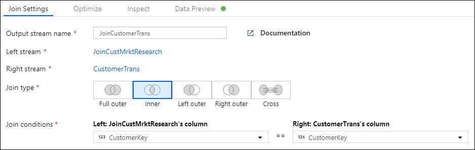

### Task 5: Create the SQL Data Warehouse data sink

1.  Before we load the data let's remove the duplicate join columns. Select the **+** symbol to the right of your **JoinCustomerTrans** join operation and then choose **Select**.

2.  On the **Select Settings** tab, use the following configurations:

    - Output stream name: **SelectColumns**
    - Incoming stream: **JoinCustomerTrans**
    - Skip duplicate inputs: *checked*
    - Skip duplicate outputs: *checked*
    - Auto Mapping: *enabled*

    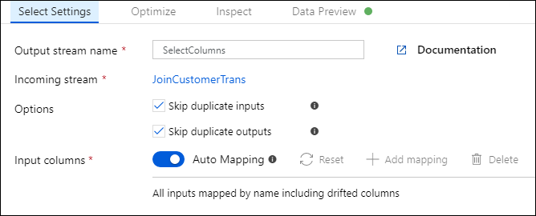

3.  You can review the results on the **Data Preview** tab to verify that the duplicate columns do not show up in the output.

4.  Now let's load the data into our SQL Data Warehouse. Select the **+** symbol to the right of your **SelectColumns** operation and then choose **Sink** at the bottom of the list.

5.  On the sink tab, name the output stream **CohoDW** and then select **+ New** next to create a new sink dataset.

    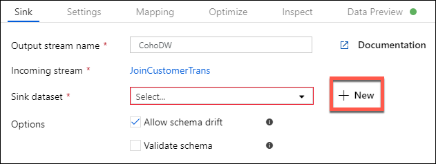

6.  From the **New Dataset** window, select **Azure SQL Data Warehouse** and then select **Continue**.

    

7.  On the **Set Properties** windows, use the following configurations and then select **OK**. 

    - Name: **CohoDW** 
    - Linked service: **CohoDW**
    - Create new table: *selected*
    - Schema and table name: **dbo**.**Customer360**

8.  On the **Settings** tab, verify that **Allow insert** is checked and table action is set to **None** and **Enable staging** is checked.

    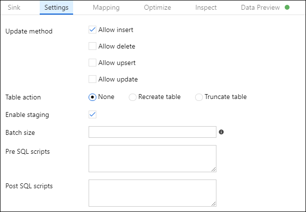

9.  Use the **Inspect** and **Data Preview** tabs to verify that your configuration is correct.

10. Select **Publish All** to publish and save your work.

    >**Note**: If you have errors in your data flow it will cause publishing to fail.

### Task 6: Create and run the pipeline 

1.  To execute out data flow, we need to add it to a pipeline. In the Factory Resources menu, select the 0 next to **Pipelines** and choose **New pipeline**.

    

2.  On the general tab below the canvas, rename your pipeline to **Customer360toCohoDWpipeline**.

    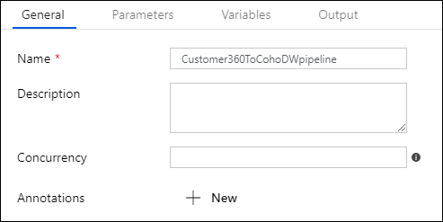

3.  Expand **Move & Transform** under Activities and drag and drop **Data Flow** to the canvas.

    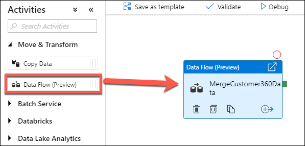

4.  In the **Adding Data Flow** window, select **Use existing data flow** and choose the **MergeCustomer360Data** data flow that you just created. Select **Finish**.

    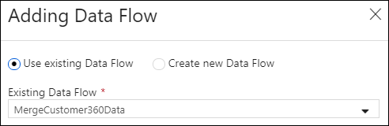

5.  On the **Settings** tab below the canvas, we need to set the Polybase configuration. Select **Coho360BlobStorage** for the staging linked service and choose the **coho360staging** container for the staging storage folder. 

    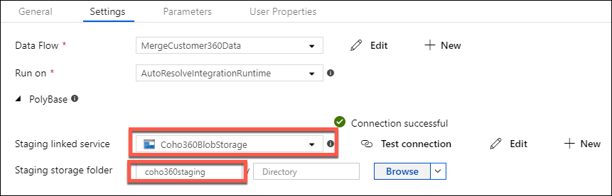

6.  Select **Publish All** to publish and save your pipeline.

7.  To test your pipeline, select the **Add trigger** button, then choose **Trigger now**, then select **Finish**.

    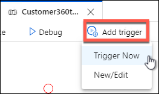

8.  To view the progress of your pipeline, select the monitor dashboard on the left hand side of the screen.

    

9.  You can monitor the progress of your pipeline run here. Use the refresh button to update the metrics. 

    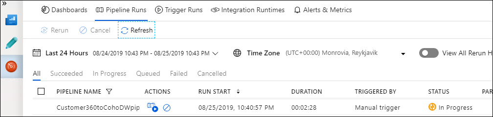

## Exercise 6: Create an Analysis Services Model

Coho has provided you with an existing Analysis Services model for use with the Data Warehouse. They have asked you to use this model to support ad-hoc query access from Power BI.

In this exercise, you will configure backup, restore for Analysis Services, and create a tabular model to allow ad-hoc queries from client tools.

### Task 1: Configure Analysis Services backup

1.  Navigate to your Analysis Services instance and select on **Backups** under settings in the menu.

    

2.  Set backups to **Enabled**.

    

3.  Select the **Backup Storage Settings** tile and then select **+Storage account** from the menu bar at the top of the screen.

    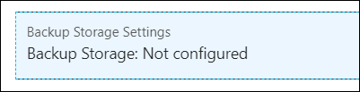

    

4.  On the Create storage account blade, use the following configurations, and select **OK**:

    -   Name: **Choose a unique storage account name**.

    -   Account kind: **StorageV2 (general purpose V2)**

    -   Performance: **Standard**

    -   Replication: **Locally-redundant storage (LRS)**

    -   Location: **The same location you have been using for this lab**.

5.  Choose the storage account you just created to open the Containers blade (you may need to select the refresh button). Select **+Container** to create a new container, type **backups** for the name, and select **OK**.

    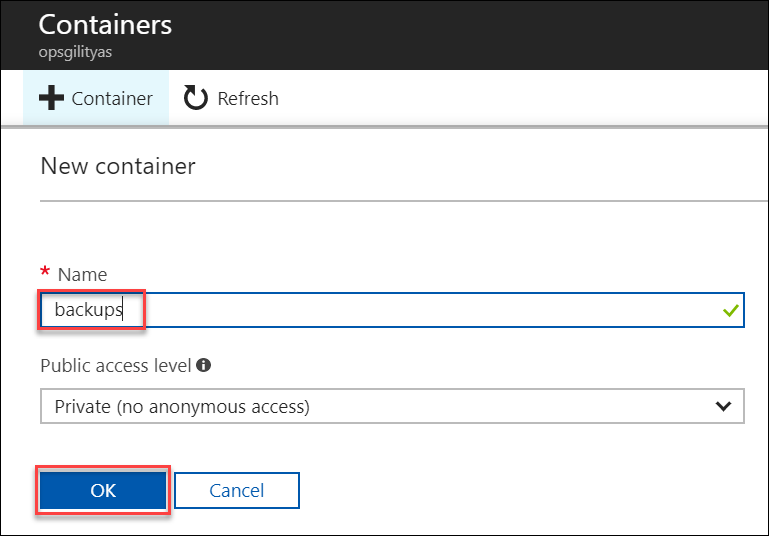

6.  On the **Containers** blade, select on the newly created **backups** Container, then choose **Select**.

    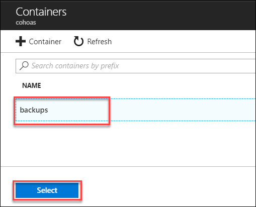    

7.  On the Backups blade, select the **Save** button.

    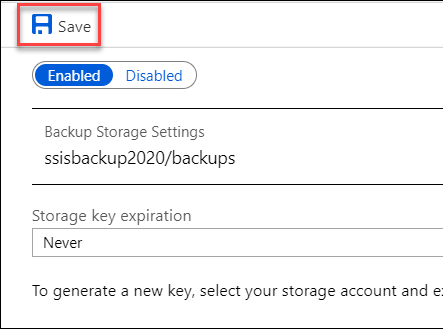

### Task 2: Restore Analysis Services backup

1.  From the Analysis Services overview blade, hover over the server name and select the copy icon to **copy the Server name**. Save this into notepad for use later in this task.

    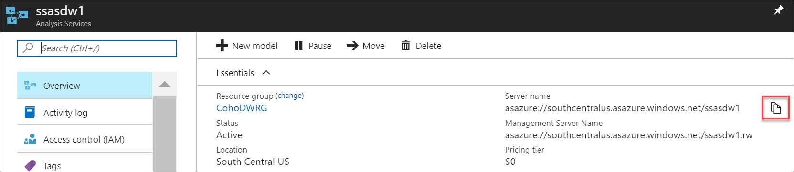

2.  In the Azure Portal, navigate to the storage account you just created, select the **Containers** tile, and open the **backups** container.

3.  Select **Upload**.

    

4.  Select the Select a file icon, and upload the **C:\\LabFiles\\coho-data-model.abf** file, and select **Upload**.

    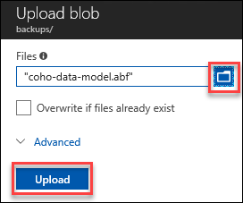

5.  Login to your SQLcohoDW virtual machine, and open **SQL Server Management Studio**.

    

6.  Connect to your Analysis Server.

    -   Server Type: **Analysis Services**

    -   Server name: **The server name you copied earlier**.

    -   Authentication: **Active Directory - Password**

    -   User name: **asadmin@\<subscription\_name\>.\<domain\>**

        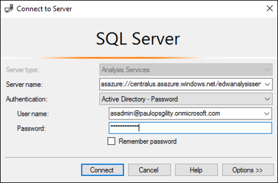

        >**Note**: If you are using your own organizational account instead of the one we created earlier in the lab then you will put that in for the user name. You may also need to update the authentication type depending on the requirements of your organization (for example, if you use multi-factor authentication).

    The User name setting should be in the form \<name\>@\<your-domain\>. If you do not know your domain name, you can get it by navigating to the Azure Portal and hovering over your login information in the upper right corner of your browser window.

7.  Right-select the Databases folder and choose **Restore...**

    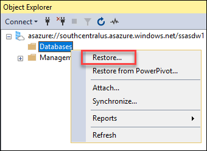

8.  Select the backup file by selecting the **Browse** button and selecting the **coho-data-model.abf** file from the storage account. Select **OK** to accept the backup file.

    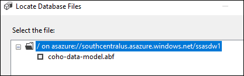

9.  Type **coho-data-model** into the Restore database field, and select **OK** to restore the database.

    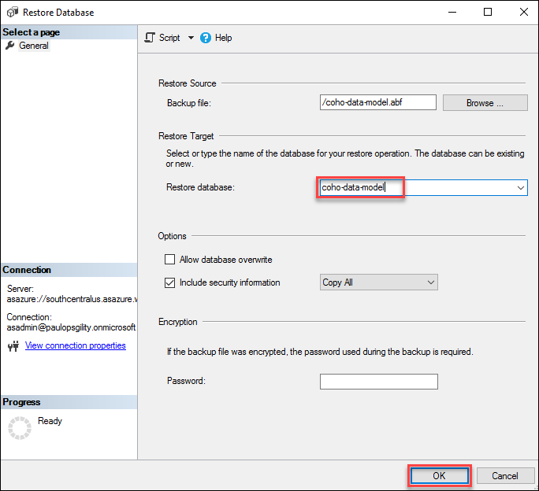

10. Refresh the databases folder, and you should see your coho-data-model now.

    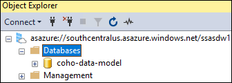

### Task 3: Update Analysis Services connections

1.  From SQL Server Management Studio, expand the **coho-data-model** database, expand **Connections**, right-select **CohoDW**, script the connection as **CREATE OR REPLACE To** a **New Query Editor Window**.

    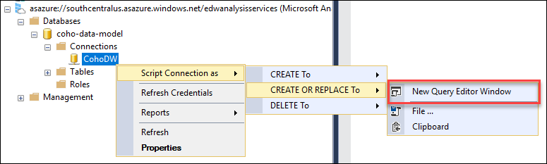

2.  Modify the connection string to point to your SQL Data Warehouse and include **Password=Demo@pass123;** after the **User ID**.

    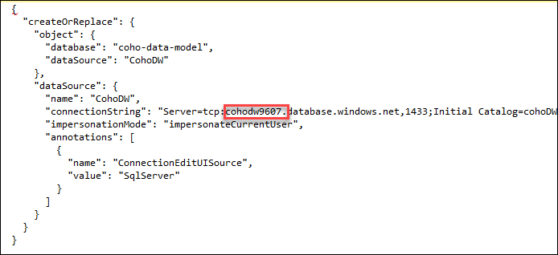

3.  From the Query menu, select **Execute** to update the connection.

    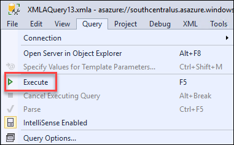

3.  Right-select the **coho-data-model** database, and choose **Process Database**.

    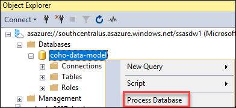

4.  Change the **Mode** to **Process Full** and then select **OK** on the Process Data window.

    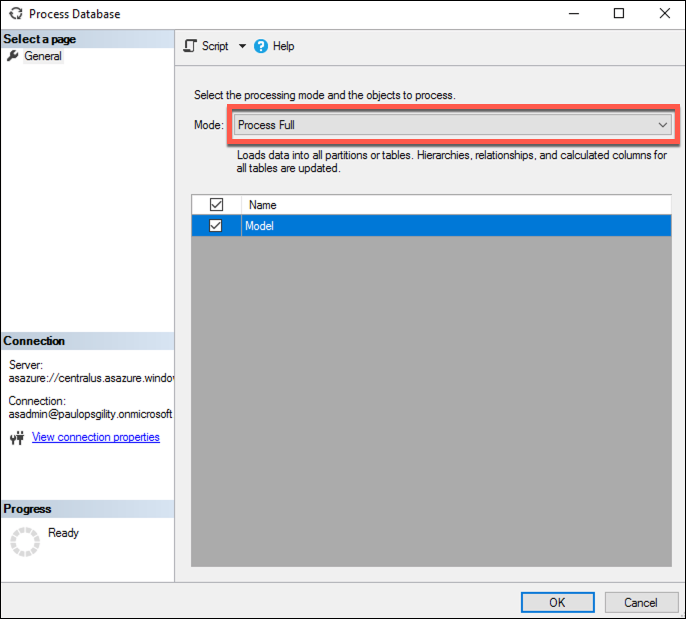

5.  Close the Process Data window.

## Exercise 7: Visualize data with Power BI Desktop

In this exercise, you will setup integration with Power BI Desktop.

### Task 1: Install Power BI Desktop

1.  Connect to the **SQLcohoDW** virtual machine.

2.  In a web browser, navigate to the Power BI Desktop download page (<https://powerbi.microsoft.com/en-us/desktop/>).

3.  Select the **See Download Or Language Options** link in the middle of the page.

    

4. Check the box next to **PBIDesktopSetup_x64.exe** and select the **Next** button.

    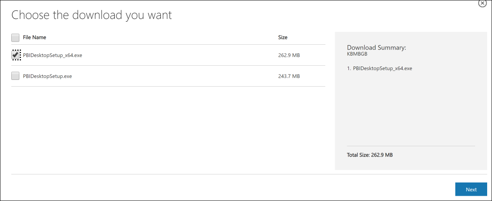

5.  Run the installer.

    

6.  Select **Next** on the welcome screen.

    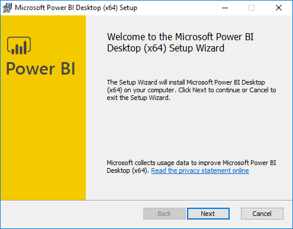

7.  Accept the license agreement, and select **Next**.

    

8.  Leave the default destination folder, and select **Next**.

    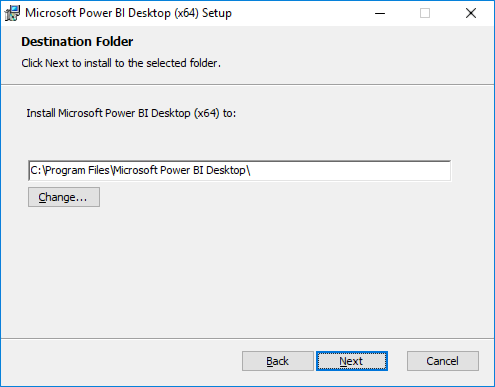

9.  Make sure the Create a desktop shortcut box is checked, and select **Install**.

    

10. Verify that Launch Microsoft Power BI Desktop is checked, and select **Finish**.

    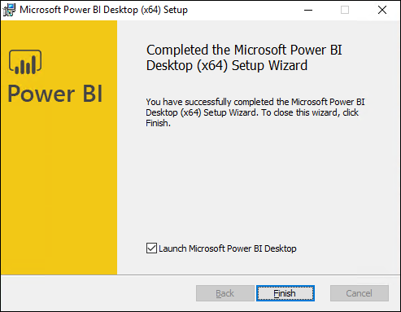

### Task 2: Query data with Power BI Desktop

1.  Connect to the Azure Portal, and navigate to your Azure Analysis Services.

2.  Make note of your Analysis Server name to use in your data source configuration later in this task.

    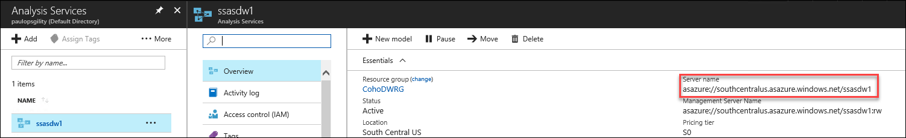

3.  From within Power BI, select the **Get Data** button.

    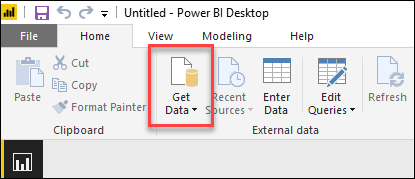

4.  On the Get Data window, select **Azure Analysis Services**.

    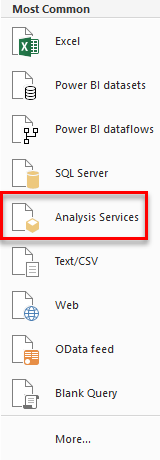

5.  On the **SQL Server Analysis Services database** screen, provide the name of your Analysis Server service, type **,** make sure that **Connect live** is selected, and select **OK**.

    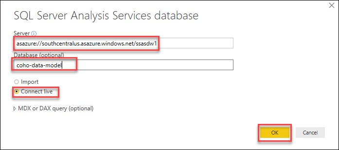

6.  Login with your **asadmin** Active Directory Azure credentials that you created earlier.

7.  Select your Analysis Services database.

8.  In the Fields blade in the dark grey side bar to the right, expand the **DimGeography** dimension and check the box next to **CountryRegionCode**. This will automatically launch the map visualization because Power BI is smart enough to understand this is geographic data.

    

9.  The circles that Power BI adds to the map are simply every country/region in which Coho had sales. Let's add the sales amount to this to make the map a little more interesting. Add the **SalesAmount** from the **FactInternetSales** table by putting a check next to it. The circles on the map will change in size to reflect the sum of all sales in that particular country/region.

    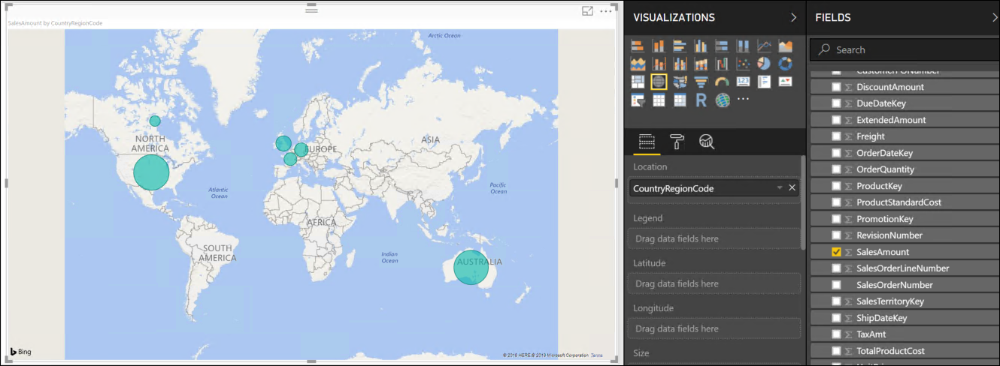

10. We want to see a little more specific detail around what these circles actually mean, so let's add a legend to identify the countries/regions. Drag the **EnglishCountryRegionName** field under **Legend**.

    

11. Select the **Save** button in the top left of your screen, name your report **Sales by countryregion,** and select **Save**.

## After the hands-on Lab 

To prevent excessive charges, you should cleanup the resources you have created for this lab.

### Task 1: Cleanup resource groups

1.  From the Azure Portal, navigate to the **CohoCloud** resource group.

2.  From the resource group overview blade, select **Delete resource group**.

    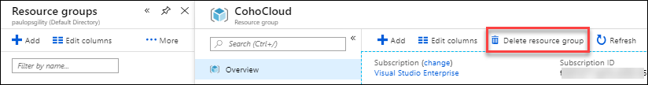

3.  Type the name of the resource group to confirm the delete request, and select **delete**.

4.  Repeat the process to delete the **CohoOnPremEnvironment** resource group.

You should follow all steps provided *after* attending the hands-on lab.

