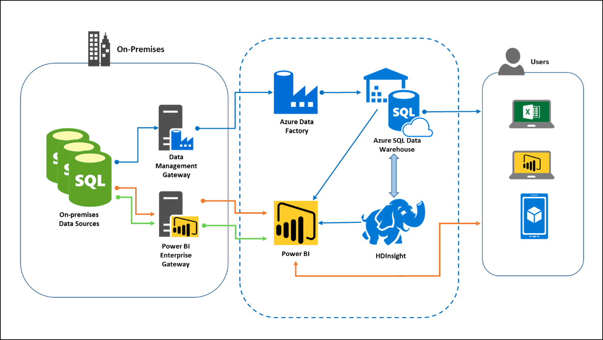

Migrate EDW to Azure SQL Data Warehouse

Whiteboard design session  trainer guide

October 2019

Information in this document, including URL and other Internet Web site references, is subject to change without notice. Unless otherwise noted, the example companies, organizations, products, domain names, e-mail addresses, logos, people, places, and events depicted herein are fictitious, and no association with any real company, organization, product, domain name, e-mail address, logo, person, place or event is intended or should be inferred. Complying with all applicable copyright laws is the responsibility of the user. Without limiting the rights under copyright, no part of this document may be reproduced, stored in or introduced into a retrieval system, or transmitted in any form or by any means (electronic, mechanical, photocopying, recording, or otherwise), or for any purpose, without the express written permission of Microsoft Corporation.

Microsoft may have patents, patent applications, trademarks, copyrights, or other intellectual property rights covering subject matter in this document. Except as expressly provided in any written license agreement from Microsoft, the furnishing of this document does not give you any license to these patents, trademarks, copyrights, or other intellectual property.

The names of manufacturers, products, or URLs are provided for informational purposes only and Microsoft makes no representations and warranties, either expressed, implied, or statutory, regarding these manufacturers or the use of the products with any Microsoft technologies. The inclusion of a manufacturer or product does not imply endorsement of Microsoft of the manufacturer or product. Links may be provided to third party sites. Such sites are not under the control of Microsoft and Microsoft is not responsible for the contents of any linked site or any link contained in a linked site, or any changes or updates to such sites. Microsoft is not responsible for webcasting or any other form of transmission received from any linked site. Microsoft is providing these links to you only as a convenience, and the inclusion of any link does not imply endorsement of Microsoft of the site or the products contained therein.

© 2019 Microsoft Corporation. All rights reserved.

Microsoft and the trademarks listed at <https://www.microsoft.com/en-us/legal/intellectualproperty/Trademarks/Usage/General.aspx> are trademarks of the Microsoft group of companies. All other trademarks are property of their respective owners.

**Contents**

<!-- TOC -->

- [Trainer information](#trainer-information)
  - [Role of the trainer](#role-of-the-trainer)
  - [Whiteboard design session flow](#whiteboard-design-session-flow)
  - [Before the whiteboard design session: How to prepare](#before-the-whiteboard-design-session-how-to-prepare)
  - [During the whiteboard design session: Tips for an effective whiteboard design session](#during-the-whiteboard-design-session-tips-for-an-effective-whiteboard-design-session)
- [Migrate EDW to Azure SQL Data Warehouse whiteboard design session student guide](#migrate-edw-to-azure-sql-data-warehouse-whiteboard-design-session-student-guide)
  - [Abstract and learning objectives](#abstract-and-learning-objectives)
  - [Step 1: Review the customer case study](#step-1-review-the-customer-case-study)
    - [Customer situation](#customer-situation)
    - [Customer needs](#customer-needs)
    - [Customer objections](#customer-objections)
    - [Infographic for common scenarios](#infographic-for-common-scenarios)
  - [Step 2: Design a proof of concept solution](#step-2-design-a-proof-of-concept-solution)
  - [Step 3: Present the solution](#step-3-present-the-solution)
  - [Wrap-up](#wrap-up)
  - [Additional references](#additional-references)
- [Migrate EDW to Azure SQL Data Warehouse whiteboard design session trainer guide](#migrate-edw-to-azure-sql-data-warehouse-whiteboard-design-session-trainer-guide)
  - [Step 1: Review the customer case study](#step-1-review-the-customer-case-study-1)
  - [Step 2: Design a proof of concept solution](#step-2-design-a-proof-of-concept-solution-1)
  - [Step 3: Present the solution](#step-3-present-the-solution-1)
  - [Wrap-up](#wrap-up-1)
  - [Preferred target audience](#preferred-target-audience)
  - [Preferred solution](#preferred-solution)
  - [Checklist of preferred objection handling](#checklist-of-preferred-objection-handling)
  - [Customer quote (to be read back to the attendees at the end)](#customer-quote-to-be-read-back-to-the-attendees-at-the-end)

<!-- /TOC -->

# Trainer information

Thank you for taking time to support the whiteboard design sessions as a trainer!

## Role of the trainer

An amazing trainer:

-   Creates a safe environment in which learning can take place.

-   Stimulates the participant's thinking.

-   Involves the participant in the learning process.

-   Manages the learning process (on time, on topic, and adjusting to benefit participants).

-   Ensures individual participant accountability.

-   Ties it all together for the participant.

-   Provides insight and experience to the learning process.

-   Effectively leads the whiteboard design session discussion.

-   Monitors quality and appropriateness of participant deliverables.

-   Effectively leads the feedback process.

## Whiteboard design session flow 

Each whiteboard design session uses the following flow:

**Step 1: Review the customer case study (15 minutes)**

**Outcome**

Analyze your customer's needs.

-   Customer's background, situation, needs and technical requirements

-   Current customer infrastructure and architecture

-   Potential issues, objectives and blockers

**Step 2: Design a proof of concept solution (60 minutes)**

**Outcome**

Design a solution and prepare to present the solution to the target customer audience in a 15-minute chalk-talk format.

-   Determine your target customer audience.

-   Determine customer's business needs to address your solution.

-   Design and diagram your solution.

-   Prepare to present your solution.

**Step 3: Present the solution (30 minutes)**

**Outcome**

Present solution to your customer:

-   Present solution

-   Respond to customer objections

-   Receive feedback

**Wrap-up (15 minutes)**

-   Review preferred solution

## Before the whiteboard design session: How to prepare

Before conducting your first whiteboard design session:

-   Read the Student guide (including the case study) and Trainer guide.

-   Become familiar with all key points and activities.

-   Plan the point you want to stress, which questions you want to drive, transitions, and be ready to answer questions.

-   Prior to the whiteboard design session, discuss the case study to pick up more ideas.

-   Make notes for later.

## During the whiteboard design session: Tips for an effective whiteboard design session

**Refer to the Trainer guide** to stay on track and observe the timings.

**Do not expect to memorize every detail** of the whiteboard design session.

When participants are doing activities, you can **look ahead to refresh your memory**.

-   **Adjust activity and whiteboard design session pace** as needed to allow time for presenting, feedback, and sharing.

-   **Add examples, points, and stories** from your own experience. Think about stories you can share that help you make your points clearly and effectively.

-   **Consider creating a "parking lot"** to record issues or questions raised that are outside the scope of the whiteboard design session or can be answered later. Decide how you will address these issues, so you can acknowledge them without being derailed by them.

***Have fun**! Encourage participants to have fun and share!*

**Involve your participants.** Talk and share your knowledge but always involve your participants, even while you are the one speaking.

**Ask questions** and get them to share to fully involve your group in the learning process.

**Ask first**, whenever possible. Before launching into a topic, learn your audience's opinions about it and experiences with it. Asking first enables you to assess their level of knowledge and experience, and leaves them more open to what you are presenting.

**Wait for responses**. If you ask a question such as, "What's your experience with (fill in the blank)?" then wait. Do not be afraid of a little silence. If you leap into the silence, your participants will feel you are not serious about involving them and will become passive. Give participants a chance to think, and if no one answers, patiently ask again. You will usually get a response.

# Migrate EDW to Azure SQL Data Warehouse whiteboard design session student guide

## Abstract and learning objectives

This whiteboard design session will look at the process of migrating an on-premises data warehouse to Azure SQL Data Warehouse. The design session will cover planning for a data warehouse migration, data and schema preparation, data loading, optimizing the data distribution, building a solution to support ad-hoc queries, migrating existing ETL packages and visualizing data with Power BI. 

At the end of this whiteboard design session, you will be better able to plan and implement a migration of your existing on-premises enterprise data warehouse to Azure SQL Data Warehouse and integrating it with both cloud-based and on-premises services and data sources.

## Step 1: Review the customer case study 

**Outcome**

Analyze your customer's needs.

Timeframe: 15 minutes

Directions: With all participants in the session, the facilitator/SME presents an overview of the customer case study along with technical tips.

1.  Meet your table participants and trainer.

2.  Read all of the directions for steps 1-3 in the student guide.

3.  As a table team, review the following customer case study.

### Customer situation

Coho is a retail company based in Austin, Texas that focuses on buying and selling mobile electronics and services. Coho has approximately 500 stores spread throughout the United States and a successful direct-to-consumer e-commerce site. Last year Coho began migrating to the cloud with development/test environments moving first and upgrading all store personnel to using Office 365 last year. This included configuring Azure Active Directory AD.

Coho sales data is a mix of online website orders and in-store point of sales data. Coho stores use a third-party point of sales system that writes transactional data to an operational data store in real-time. The Coho e-commerce site is built with .NET and uses SQL Server 2014 to store customer profiles and online order information. Sales data from both the Point of Sale (POS) system and the website are transferred every night via SQL Server Integration Service (SSIS) packages to a central data warehouse. In order to support all of the required report functionality, other data from various systems is loaded to the data warehouse as well. The most critical of these is the product load which loads all of the product information from the Product Master Data system which is updated by the business throughout the day. Due to the vast amount of ETL they currently have, they would like to minimize the amount of rewriting and limit ETL changes to connection strings and high-value transformations only. The data warehouse itself is currently hosted on SQL Server 2012. Frances Bradley, the Manager of Data Warehousing, states, "We have outgrown the current data warehouse. The system runs just fine most of the year but a few times per year the system is just stressed beyond the limit."

The customer analytics systems are very rudimentary and take too long to extract insights from the data. Sales and customer profile data are sent to a third-party data company once per day. The company then combines this sales data with its own information about the customer, cleanses and aggregates the raw customer data, and sends the curated results back to Coho the next day wherein the analytics and marketing teams can begin reviewing the data (typically using Excel). Obviously, this is taking a long time from start to finish. According to Jude Watkins, the Director of Customer Analytics, "We need to be able to react quicker. Our data is currently stored in a dedicated on-premises SQL Server for now but with the new Customer 360 project that is in pilot now we are going to capitalize on HDInsight to store and process the raw data ourselves. We sometimes pull up-to-date data from the warehouse but due to performance concerns on the warehouse side this is not done on a regular basis. We need our data to be near real-time. We also need access to warehouse data on a regular basis. A key pillar to this effort will be a data warehouse solution that can handle the analytics workloads on a daily basis, even on high traffic days." The upcoming "Customer 360" project will bring all of the third-party data processing and curation in-house, so Coho can do their own analytics as the data arrives instead being dependent on third-party processing.

The current reporting system is also quite limited. After the data loads have completed, the reports are generated and emailed out to all store managers and up. Reports are customized for the individual user's role and store/region. As part of the warehouse migration Coho would like to implement a self-serve BI platform to supplement the emailed reports. The current reports are very basic, mostly text. Reports primarily draw from the data warehouse sales data but also pull from some other SQL Servers and pull the critical Key Performance Indicator KPIs from SQL Server Analysis Server which is hosted on a separate machine from the warehouse. The business would like to see mobile access to their reports and dashboards while marketing and analytics want more advanced self-service BI and analytics features. The Vice President of Store Operations, Sloane Peterson, says, "Regional and store managers need to spend more time making their stores successful and less time pouring over spreadsheets in the back office. The current reports have valuable information, but this format is difficult to read on a mobile device and the data is not always clear. I want managers to have the same insights that we have at HQ."

**Current Coho EDW architecture**

![The Current Coho EDW architecture consists of an on-premises data warehouse that pulls data from a variety of on-premises data sources. A 3rd-party data processing company receives a dataset from Coho every day and supplements and aggregates the data with additional customer data. Updated sales data is periodically pulled from the warehouse but not on a consistent basis. Users receive static reports that are generated directly from the warehouse and analytics users query their own analytics database via Excel.](images/Whiteboarddesignsessionstudentguide-MigrateEDWtoAzureSQLDataWarehouseimages/media/image2.png)

### Customer needs 

1.  A data warehouse solution that allows Coho to scale to meet peak demand while keeping costs in check. At any point in time we may have 50+ queries running. We need to be able to handle this type of load. How do we choose appropriate performance levels?

2.  Create a process for continued integration with the e-commerce site and the on-premises data sources. They would like to minimize the amount of rewrite necessary for ETL/ELT processes to only high value changes. They have hundreds of SSIS packages they do not want to rewrite. How do we migrate these to Azure?

3.  Warehouse solution should integrate with the upcoming customer 360 project.

4.  Upgrade the existing reporting system with a solution that supports self-service BI.

5.  This warehouse contains Personally Identifiable Information. It is absolutely critical that this data is not exposed.

### Customer objections 

1.  We are concerned about spending too much to accommodate peak loads. We do not want to pay for a lot of excess warehouse capacity all year just to handle Black Friday. How will this solution help us control costs?

2.  We cannot take a week-long outage to perform the migration. How are we optimizing the migration?

3.  How will we integrate with existing analytics systems?

4.  We need to prepare for the customer 360 project. How will the new data warehouse solution integrate with HDInsight?

5.  We would like to have the ability to archive data from the warehouse, but we cannot have data completely offline.

6.  The self-service BI solution must be able to query the sales data in the warehouse as well as on-premises data sources. How will this system accomplish these goals?

7.  We have heard that Azure SQL Data Warehouse does not support geo-replication as in SQL Database. Help us understand how Azure protects our data in Azure SQL Data Warehouse.

8.  It looks like Azure SQL Database supports columnstore tables for warehouse workloads like ours. When would we choose Azure SQL Database over Azure SQL Data Warehouse?

### Infographic for common scenarios

**Azure SQL Data Warehouse**

**Azure Analysis Services**

**Azure Data Factory**

**Power BI**

![The Power BI screenshot contains several comparative graphs about a Retail Store\'s Performance. At the top, left, a line graph has two lines comparing this year\'s and last year\'s sales records by month. Under this graph is a table listing the Top 10 products by rank and total sales. On the right side is a box graph (a box filled with smaller boxes). Boxes vary by size depending on their sales. Underneath the box graph is a bubble chart comparing Sales variances by percentages for Chain, Fashions Direct, and Lindseys. At the bottom are pictures of District Managers, and hyperlinks to more information about them.](images/Whiteboarddesignsessionstudentguide-MigrateEDWtoAzureSQLDataWarehouseimages/media/image6.png)

## Step 2: Design a proof of concept solution

**Outcome**

Design a solution and prepare to present the solution to the target customer audience in a 15-minute chalk-talk format.

Timeframe: 60 minutes

**Business needs**

Directions:  With all participants at your table, answer the following questions and list the answers on a flip chart:

1.  Who should you present this solution to? Who is your target customer audience? Who are the decision makers?

2.  What customer business needs do you need to address with your solution?

**Design**

Directions: With all participants at your table, respond to the following questions on a flip chart:

*Plan a data warehouse migration*

1. **Data preparation**: Coho needs to validate its database compatibility. Develop a high-level checklist of all of the steps necessary to validate compatibility including any tools you might use.

2. **Data warehouse sizing:** Determine the appropriate sizing/performance configuration for the data warehouse.

3. **Migration process:** Design a secure migration process that minimizes downtime. Your migration process should include the following:

    a.  Recommendations for migrating and validating schema

    b.  Recommendations for migrating and validating data

    c.  Recommendations for migrating and validating code

    d.  Architectural considerations that may be necessary for running on SQL Data Warehouse

4. **Post migration steps:** Define any post migration steps that should be run to prepare the database.

5. **Diagram the solution**

*Data warehouse integration*

1. **Plan**: Identify integration points:

    a.  How will data from the warehouse be integrated with data in HDInsight?

    b.  Which Extract, Transform, and Load (ETL) process will be migrated?

    c.  What changes will be necessary for ETL that are out of scope of this project?

    d.  How do they lift and shift SSIS packages for execution in Azure?

2. **Connecting with existing systems**: Provide the configuration details for setting up connectivity back to on-premises data sources.

3. **Diagram the solution**

*Self-service BI*

1. **Describe self-service BI:**

    a.  How does the solution meet the mobile requirements?

    b.  How does this design meet the stated security goals?

    c.  We are trying to minimize costs. How many licenses would we need to purchase?

2. **Provide the following configuration details:**

    a.  How will this solution connect back to the on-premises data sources?

    b.  How will users be licensed/given access to Power BI?

    c.  What impact will this solution have on the performance of the Azure SQL Data Warehouse?

3. **Diagram the solution**

**Prepare**

Directions: With all participants at your table:

1.  Identify any customer needs that are not addressed with the proposed solution.

2.  Identify the benefits of your solution.

3.  Determine how you will respond to the customer's objections.

Prepare a 15-minute chalk-talk style presentation to the customer.

## Step 3: Present the solution

**Outcome**

Present a solution to the target customer audience in a 15-minute chalk-talk format.

Timeframe: 30 minutes

**Presentation**

Directions:

1.  Pair with another table.

2.  One table is the Microsoft team and the other table is the customer.

3.  The Microsoft team presents their proposed solution to the customer.

4.  The customer makes one of the objections from the list of objections.

5.  The Microsoft team responds to the objection.

6.  The customer team gives feedback to the Microsoft team.

7.  Tables switch roles and repeat Steps 2-6.

##  Wrap-up 

Timeframe: 15 minutes

Directions: Tables reconvene with the larger group to hear the facilitator/SME share the preferred solution for the case study.

##  Additional references
|    |            |
|----------|:-------------:|
| **Description** | **Links** |
|  Azure SQL Data Warehouse  |  <https://docs.microsoft.com/en-us/azure/sql-data-warehouse/sql-data-warehouse-overview-what-is>   |
|  Azure Database Migration Guide | <https://datamigration.microsoft.com/scenario/sql-to-sqldw?step=1>  |
|  Load data into Azure SQL Data Warehouse | <https://azure.microsoft.com/en-us/documentation/articles/sql-data-warehouse-overview-load/>  |
|  Manage tables and indexes in Azure SQL Data Warehouse |  <https://azure.microsoft.com/en-us/documentation/articles/sql-data-warehouse-overview-manage-tables-indexes/>  |
| Leverage other services with SQL Data Warehouse   | <https://azure.microsoft.com/en-us/documentation/articles/sql-data-warehouse-overview-integrate/>      |
| Copy data from an on-premises SQL Server database to Azure Blob storage | <https://docs.microsoft.com/en-us/azure/data-factory/tutorial-hybrid-copy-portal>    |
| Azure Analysis Services  | <https://docs.microsoft.com/en-us/azure/analysis-services/analysis-services-overview>   |
| Power BI Gateway   | <https://powerbi.microsoft.com/en-us/gateway/>   |

# Migrate EDW to Azure SQL Data Warehouse whiteboard design session trainer guide

## Step 1: Review the customer case study

-   Check in with your table participants to introduce yourself as the trainer.

-   Ask, "What questions do you have about the customer case study?"

-   Briefly review the steps and timeframes of the whiteboard design session.

-   Ready, set, go! Let the table participants begin.

## Step 2: Design a proof of concept solution

-   Check in with your tables to ensure that they are transitioning from step to step on time.

-   Provide some feedback on their responses to the business needs and design.

    -   Try asking questions first that will lead the participants to discover the answers on their own.

-   Provide feedback for their responses to the customer's objections.

    -   Try asking questions first that will lead the participants to discover the answers on their own.

## Step 3: Present the solution

-   Determine which table will be paired with your table before Step 3 begins.

-   For the first round, assign one table as the presenting team and the other table as the customer.

-   Have the presenting team present their solution to the customer team.

    -   Have the customer team provide one objection for the presenting team to respond to.

    -   The presentation, objections, and feedback should take no longer than 15 minutes.

    -   If needed, the trainer may also provide feedback.

## Wrap-up

-   Have the table participants reconvene with the larger session group to hear the facilitator/SME share the following preferred solution.

##  Preferred target audience

-   Frances Bradley, Manager of Data Warehousing

-   Jude Watkins, Director of Customer Analytics

-   Sloane Peterson, Vice President of Store Operations

## Preferred solution

The solution for Coho\'s scenario involved several technologies:

1.  Migrating to Azure SQL Data Warehouse.

2.  Using the Migration Advisor as a starting point for migration.

3.  Uploading data to Azure Blob storage, then loading the data via Polybase to minimize the time needed to load the new warehouse.

4.  Taking advantage of new features such as Clustered Columnstore Indexes to optimize performance.

5.  Following best practices for minimizing data movement across the nodes of the warehouse by using hash distribution where appropriate.

6.  Using external tables to query data stored in Azure Storage.

7.  Migrating existing ETL to Azure Data Factory.

8.  Allowing ad-hoc access to data warehouse data by implementing Azure Analysis Services.

9.  Capitalizing on Power BI to enable self-service BI.

*Plan for data warehouse migration*

1.  **Data preparation**: Coho needs to validate its database compatibility. Develop a high-level checklist of all off the steps necessary to validate compatibility including any tools you might use.

    **Answer**: The data preparation phase or the pre-migration phase is when you plan your migration. Here is a minimal list of or research to get you started:

    -   Database size(s). Not all databases will necessarily be migrated. Identify the databases to be migrated and note the sizes.

    -   Performance baseline. If a recent performance baseline does not exist, you should get one now.

    -   Dependent applications and users. For applications, the owner should be identified. You will need to coordinate with application owners throughout the migration process.

    -   Jobs and maintenance. Some of this may or may not be relevant. Document the maintenance and determine if migration needs to occur or if the job needs to be rewritten.

    -   Linked Servers. Are these related to dependent applications or particular ETL jobs, and do we still need these?

    -   Database logins. Evaluate each login for need.

    -   Schema compatibility: <https://azure.microsoft.com/en-us/documentation/articles/sql-data-warehouse-migrate-schema/>.

    -   Code compatibility: <https://azure.microsoft.com/en-us/documentation/articles/sql-data-warehouse-migrate-code/>.

    -   Data compatibility: <https://azure.microsoft.com/en-us/documentation/articles/sql-data-warehouse-migrate-data/>.

    -   Architectural changes. For example, defining the distribution of your data across the nodes of the warehouse.

2.  **Data warehouse sizing:** Determine the appropriate sizing/performance configuration for the data warehouse.

    **Answer:** Azure SQL Data Warehouse has a different architecture than a typical single server data warehouse. This makes direct comparisons less than perfect. Fortunately, Azure SQL Data Warehouse scales very easily on the fly with no downtime for the data warehouse. When testing performance, it is recommended that you use at least 1 TB of data.

    -   Recommendations for finding the best Data Warehouse Unit DWU for your workload:

        -   For a data warehouse in development, begin by selecting a small number of DWUs.

        -   Monitor your application performance, observing the number of DWUs selected compared to the performance you observe.

        -   Determine how much faster or slower performance should be for you to reach the optimum performance level for your requirements by assuming linear scale.

        -   Increase or decrease the number of DWUs in proportion to how much faster or slower you want your workload to perform. The service will respond quickly and adjust the compute resources to meet the new DWU requirements.

        -   Continue making adjustments until you reach an optimum performance level for your business requirements.

3.  **Migration process:** Design a secure migration process that minimizes downtime. Your migration process should include the following:

    a.  Recommendations for migrating and validating schema

    b.  Recommendations for migrating and validating data

    c.  Recommendations for migrating and validating code

    d.  Architectural considerations that may be necessary for running on SQL Data Warehouse

     **Answer:** Schema and code are relatively straightforward, and incompatibilities should be resolved in the data preparation phase (see the previous links). Migrating the updated schema and code is trivial. Loading data takes more thought. For small amounts of data, it matters very little how it is migrated as the differences in load time will be negligible. Migrating data is composed of three steps:

    -   Export source data

    -   Transfer data to Azure

    -   Load data to Azure SQL Data Warehouse

    -   Data transfer optimization will depend on the data pipe throughput versus data size. If you are transferring a smaller dataset or if you are transferring data over Express Route, then you may be able to copy the data using the AZCopy utility. If the data size is too large you may also use the Azure Import and Export service.

    -   Polybase supports reading data from gzip compressed files. Compressing your data files reduces the amount of data being sent over the wire to Azure.

    -   The best load performance is achieved by using Polybase. In general, you want to capitalize on this load performance advantage during your migration. Polybase does come with some restrictions that you will need to consider.

        -   Polybase requires data files to be UTF-8 encoded. BCP does not support UTF-8, leaving ADF Copy and SSIS as your best options for data export

        -   Polybase mandates a fixed row terminator of \\n or newline

        -   Polybase can only be used to load data from Azure Blob Storage

    -   One of the primary architectural considerations will be how the data will be distributed across the Data Warehouse. Azure SQL Database stores data across many different locations known as distributions. Each distribution stores a unique subset of the data in the data warehouse. When tables are declared in Azure SQL Data Warehouse, you define how the data will be distributed across the distributions. There are two available options:

    -   **ROUND\_ROBIN**: This is the default option. It loads faster than a hash distributed table, making it a good staging target. However, it is typically not the optimal choice for query performance. It is generally suitable when there is no obvious join key in the table.

    -   **HASH**: This option uses an internal function to spread the data across the distributions by hashing a single column. The hash is a deterministic process making the results of the hash predictable. For example, hashing an integer value of 10 will always result in the same hash value. This holds true across different tables. This means that two tables that are frequently joined on an id column, that are hash distributed, will not need to move data between nodes of the warehouse to satisfy the join.

4.  **Post migration steps:** Define any post migration steps.

    **Answer:** After a migration there are several more steps that need to be executed to ensure optimal performance.

    -   After a load completes, some of the data rows might not be compressed into the columnstore. To optimize query performance and columnstore compression after a load, rebuild the table to force the columnstore index to compress all of the rows.

    -   Statistics in Azure SQL Data Warehouse are not created automatically. To enable the cost-based optimizer to find the best query plan to serve the query, we must create statistics manually. You will want to create statistics on every column used in WHERE, JOIN, GROUP BY, ORDER BY, and DISTINCT clauses. You should also create multi-column statistics on composite clauses. It is also advisable to manually update statistics after large data changes.

5.  **Diagram the solution**

    
    _Data export, transfer, and load process_

*Data Warehouse Integration*

1.  **Plan**: Identify integration points

    a.  How will data from the warehouse be integrated with data in HDInsight?

    b.  Which Extract, Transform, and Load (ETL) process will be migrated?

    c.  What changes will be necessary for ETL that are out of scope of this project?

    d.  How do they lift and shift SSIS packages for execution in Azure?

    **Answer:** The Data Warehouse will be tightly integrated with the future "Customer 360" project which will be using HDInsight as its data store. It makes sense to move some high-value ETL functionality to Azure Data Factory v2 now to support the HDInsight integration in the near future.

    -   Core ETL for point of sale and e-commerce data should migrate to Azure Data Factory v2. Evaluation should be done to determine if rewriting is necessary to take full advantage of the capability of Azure SQL Data Warehouse (read: convert ETL to ELT, using SQLDW as the transformation engine)

        -   Purely cloud based ETL associated with data archival processes that reside solely in Azure should be created in Azure Data Factory v2.

        -   Any ETL that will not be migrated to ADF will need to be validated for data type compatibility and will need connectivity updates to point to the new server.

        -   Integrating SQL Data Warehouse with HDInsight is achieved by creating external tables in Azure SQL Data Warehouse which will map to the data which will be stored in Azure Blob Storage.

        -   Likewise, querying they Data Warehouse directly can be managed via scaling up the SQL Data Warehouse to the appropriate performance level. Azure SQL Data Warehouse Gen2 can provide 5x the query performance of the previous Gen1 and allows for far more concurrency allowing us the flexibility to support multiple concurrent applications.

        -   SSIS packages can be migrated to Azure Data Factory v2 by taking advantage of the Azure-SSIS Integration Runtime.

2.  **Connecting with existing systems:** Provide the configuration details for setting up connectivity back to on-premises data sources.

    **Answer:** Azure Data Factory requires a self-hosted Integration Runtime for connectivity to on-premises data sources (or targets).

3.  **Diagram the solution**

    
    _Data Factory orchestration with on-premises data stores._

*Self-service BI*

1.  **Describe self-service BI:**

    a.  How does the solution meet the mobile requirements?

    b.  How does this design meet the stated security goals?

    c.  How will the analytics team work with the warehouse?

    **Answer:** Power BI mobile apps for Windows, iOS, and Android allow mobile access to your dashboards and reports.

    -   The analytics team can access SQL Data Warehouse using Excel or Power BI. The HDInsight cluster can be accessed through these tools as well, or through external tables in the Data Warehouse.

2.  **Provide the following configuration details:**

    a.  How will Power BI connect back to on-premises data sources?

    b.  How will users be licensed/given access to Power BI?

    c.  What impact will this solution have on the performance of the Azure SQL Data Warehouse?

    **Answer:** Power BI will capitalize on the Power BI Enterprise Gateway to connect to the on-premises data sources. This will require that users have a Power BI Pro subscription to consume reports and dashboards that make use of the Gateway.

    -   The Enterprise Gateway is installed to a local server on-premises. This gateway server will initiate a connection with the Power BI service.

    -   If users are not registered for Power BI with the same User Principal Name UPN they use on-premises, then you will need to use UPN mapping in Power BI so that users can authenticate to on-premises data sources. For example; if a user signs in to Power BI with <cathy@contoso.com>, but on-premises her UPN may be <cathy@contoso.local>. If this difference in UPN is the same for all users, then the administrator can use a single UPN mapping rule for all users to map "contso.com" to "contoso.local".

    -   Power BI users will not connect directly to the backend SQL Data Warehouse. Instead, they will connect to a data model in Analysis Services which will prevent the ad-hoc queries from negatively impacting the Data Warehouse.

3.  **Diagram the solution**

    
    
    _End to end project data flow_

## Checklist of preferred objection handling

1.  We are concerned about spending too much to accommodate peak loads. We do not want to pay for a lot of excess warehouse capacity just to handle Black Friday. How will this solution help us control costs?

    **Potential answer:**

    In SQL Data Warehouse, you can quickly scale performance out or back by increasing or decreasing compute resources of CPU, memory, and I/O bandwidth. To scale performance, all you need to do is adjust the number of data warehouse units (DWUs) that SQL Data Warehouse allocates to your database. SQL Data Warehouse quickly makes the change and handles all of the underlying changes to hardware or software.

2.  We cannot take a week-long outage to perform the migration. How are we optimizing the migration?

    **Potential answer:**

    The migration will be tackled in a multi-phased approach. The first phase will migrate the schema and code to the SQL Data Warehouse. This will be done prior to the data migration which will be the second phase. The data migration itself can be broken into three steps with each of the following optimized steps:

    -  **Export**: Use SSIS to export to multiple gzip compressed files.

    -  **Transfer**: Copy files to Azure blob storage using AZCopy. Express Route will improve performance and reliability of the copy.

    -  **Load**: Load the data from Azure blob storage using Polybase.

3.  How will we integrate with existing analytics tools and systems?

    **Potential answer:**

    The analytics teams can continue to use Excel to retrieve data with just a change to the data source connection. Additionally, they can take advantage of Power BI. Other data sources may be accessed through the Azure Analytics Services data model which can access both cloud and on-premises data sources.

4.  We need to prepare for Customer 360. How will the new data warehouse solution integrate with HDInsight?

    **Potential answer:**

    Azure SQL Data Warehouse uses Polybase to connect to the files stored in Azure Blob Storage or Azure Data Lake. This allows us to create external tables referencing the files stored there. HDInsight processes can dump data to these stores which can then be read by Azure SQL Data Warehouse. Data can also be integrated by Azure Data Factory.

5.  We would like to have the ability to archive data from the warehouse, but we cannot have data completely offline.

    **Potential answer:**

    We can archive data to Azure Blob Storage using Polybase. We can then create an external table to query the archive data.

6.  The self-service BI solution must be able to query the sales data in the warehouse as well as on-premises data sources. How will this system accomplish these goals?

    **Potential answer:**

    Power BI can access data sources in Azure and on-premises. Accessing data in our Azure SQL Data Warehouse requires that the "Allow Access by Azure Services" be enabled. To access on-premises data sources you will need to set up an Enterprise Gateway. Accessing data through an Enterprise Gateway requires a Power BI Pro subscription.

7.  We have heard that Azure SQL Data Warehouse does not support geo-replication as in SQL Database. Help us understand how Azure protects our data in Azure SQL Data Warehouse.

    **Potential answer:**

    Each Azure SQL Data Warehouse is protected by local snapshots in the primary region and geo-backups in the paired region. Snapshots support an 8-hour recovery point objective. They are taken every 4-8 hours and are available for 7 days. Geo-backups are taken once per day to the paired data center and support a 24-hour RPO. The geo-backups can be restored to any region that supports Azure SQL Data Warehouse.

8.  It looks like Azure SQL Database supports columnstore tables for warehouse workloads like ours. When would we choose Azure SQL Database over Azure SQL Data Warehouse?

    **Potential answer:**

    An individual Azure SQL Database is limited to 4TB. Scaling beyond 4TB will require sharding your warehouse across multiple Azure SQL Databases. SQL Data Warehouse Gen2 can accommodate databases up to 240TB for rowstores and unlimited storage for columnstores.

    Azure SQL Data Warehouse is an MPP system designed to scale out for warehouse workloads. SQL Database is an SMP system designed to scale for OLTP workloads with up to 8000 concurrent queries.

## Customer quote (to be read back to the attendees at the end)

"By using Azure SQL Data Warehouse, we are able to modernize our business reporting and accelerate our time to deliver insights."

--- Jude Watkins, Director of Customer Analytics, Coho

